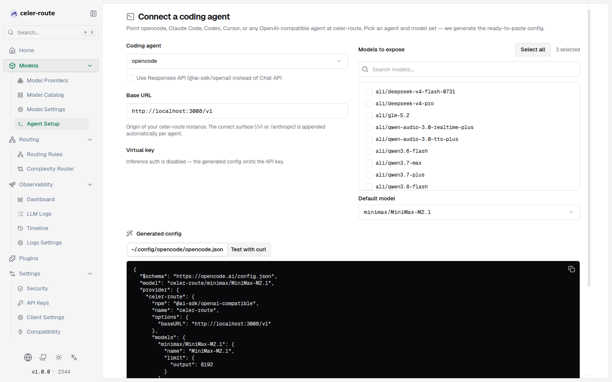
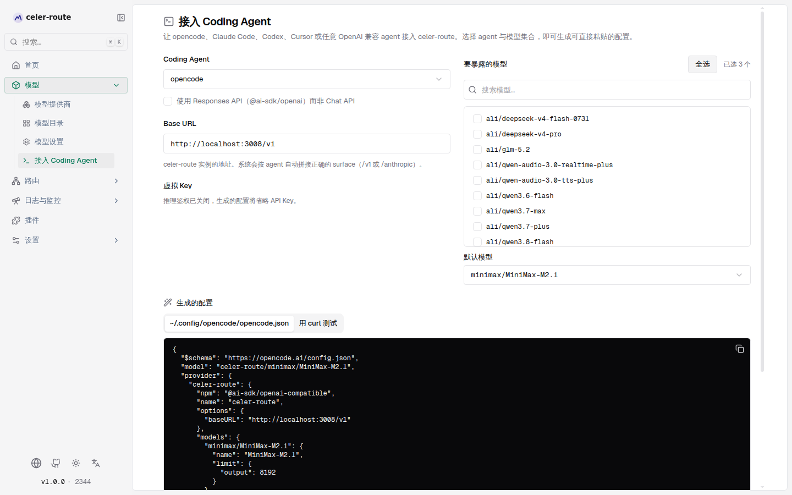

# 接入 AI 客户端

**接入 AI 客户端** 帮助你在安装并配置好 celer-route 后，把各种使用 LLM 的客户端程序接到同一套 API
上——从 opencode、Claude Code、Codex 这类编程 agent，到腾讯 WorkBuddy / CodeBuddy、智谱 ZCode、
字节 Trae / MarsCode、阿里通义灵码等国产 AI 客户端，再到 Cursor 和任意 OpenAI 兼容工具。所有
客户端都从 Web UI 上的「接入 AI 客户端」页面拿到一份可粘贴的配置（或应用内操作步骤）——选客户端、
勾选要暴露的模型、复制对应格式即可，不需要手写 JSON 或 TOML。

celer-route 网关暴露多套协议 surface：

- **OpenAI 兼容**：`{origin}/v1`（用于 opencode、Codex、WorkBuddy、Trae、hermes、openclaw、aider、goose 等）
- **Anthropic 兼容**：`{origin}/anthropic`（用于 Claude Code，会自动拼 `/v1/messages`）

**这些客户端不会自动发现模型**：多数要求把模型列表显式写进自己的配置（或手动填进设置表单）。本页的
核心价值就是从 celer-route 网关拉取实时模型目录（`/v1/models`），按你勾选的子集生成各工具的配置。



## 进入页面

- 完成[快速启动](../intro)（已部署 celer-route 并能调用一次 `chat/completions`）
- 左侧边栏 **模型 → 接入 AI 客户端**
- 或从完成 onboarding 后看到的那张「接入 AI 客户端」卡片点进去



## 三步生成配置

页面左侧是输入区，右侧是模型选择区，下方是实时生成的配置。

### 第 0 步：选择操作系统

页面顶部有一个「操作系统」选择器（自动检测你当前的系统，可手动切换）：

- **macOS / Linux**：配置文件路径用 `~/…`，环境变量用 `export KEY=value`（bash/zsh）
- **Windows**：配置文件路径用 `%USERPROFILE%\…`，环境变量同时给出 **PowerShell**（`$env:KEY = "value"`）与 **cmd**（`set KEY=value`）两种写法

选好后，下方生成的配置路径、环境变量配方与应用内步骤会整体切到对应系统。选择会写入 URL
查询参数（`?platform=windows`），刷新或分享链接后保持不变。

### 第 1 步：选择 AI 客户端

下拉列表按类别分组展示：

| 分组 | 客户端 | 走哪个协议 | 生成的配置 | 模型子集 |
|---|---|---|---|---|
| AI 编程 Agent | opencode | `/v1`（Chat 或 Responses） | `~/.config/opencode/opencode.json` | 必选（写入 `provider.models`） |
| | Claude Code | `/anthropic` | `~/.claude/settings.json` + 环境变量 | 隐藏，只需选默认模型 |
| | Codex CLI | `/v1` | `~/.codex/config.toml` + 环境变量 | 隐藏，只需选默认模型 |
| | MarsCode CLI（字节） | `/v1` | 环境变量配方（`OPENAI_*`） | 隐藏，只需选默认模型 |
| 国内桌面 Agent | WorkBuddy（腾讯） | `/v1` | `~/.workbuddy/models.json` | 必选（写入 `models[]`） |
| | ZCode（智谱） | `/v1` | 应用内操作步骤 | 隐藏，只需选默认模型 |
| IDE 与扩展 | CodeBuddy（腾讯） | `/v1` | `~/.codebuddy/models.json` | 必选（写入 `models[]`） |
| | Cursor / Windsurf | `/v1` | 应用内操作步骤（无配置文件） | 隐藏，只需选默认模型 |
| | Trae（字节） | `/v1` | 应用内操作步骤 | 隐藏，只需选默认模型 |
| | 通义灵码（阿里） | `/v1` | 应用内操作步骤 | 隐藏，只需选默认模型 |
| 通用 OpenAI 兼容 | 其他 OpenAI 兼容客户端 | `/v1` | 环境变量配方（hermes / openclaw / aider / goose） | 隐藏，只需选默认模型 |

大多数客户端的配置里只写一个默认模型（`ANTHROPIC_MODEL` / `model` / `OPENAI_MODEL` / 应用内步骤里的
「默认模型」），不需要把模型清单写进配置，所以右侧不暴露多选列表，只保留「默认模型」下拉（候选项来自
所选 API Key 在 `/v1/models` 上看到的全部模型）。

> 表格里的配置文件路径是 macOS/Linux 写法（`~/…`）；选择 **Windows** 后会自动换成
> `%USERPROFILE%\…`（反斜杠分隔），例如 `%USERPROFILE%\.claude\settings.json`。

**opencode、WorkBuddy、CodeBuddy** 三个会把整个模型清单写进配置（`models` 块 / `models[]`），因此会
显示「要暴露的模型」多选列表——勾选子集，客户端里就能按需切换。

opencode 还有一个「使用 Responses API」勾选项：勾上后会把 `npm` 切到 `@ai-sdk/openai`，调用
`/v1/responses`；不勾则用 `@ai-sdk/openai-compatible`，调用 `/v1/chat/completions`。不确定就保留默认
（Chat API，兼容性最好）。

### 第 2 步：填端点与凭证

- **Base URL**：自动填入当前访问的 origin（如 `http://localhost:8080` 或 `http://192.168.x.x:8080`）。如果你想指向远端网关，改这里即可，引擎会按客户端自动拼 `/v1` 或 `/anthropic`
- **API Key**：
  - 如果 `enforce_auth_on_inference` 打开，下拉里只能选已有 API Key（治理 → API Key 页面里管理的虚拟 Key）；没有时页面会提示去那里创建
  - 如果鉴权关闭，生成的配置里会省略 `apiKey`，方便纯本地/内网试用

### 第 3 步：选择模型

- 选择 **opencode / WorkBuddy / CodeBuddy** 时会出现「要暴露的模型」多选列表，候选项就是所选 API Key 在
  `/v1/models` 上能看到的全部模型。默认全选；点击「全选/清空」可一键切换当前筛选范围内的选择；用搜索框筛模型。WorkBuddy / CodeBuddy 会把默认模型排在 `availableModels` 最前，客户端即把它当默认
- 不论选哪个客户端，下方都有一个「默认模型」下拉
- 选完后，下方「生成的配置」立刻出现

## 生成的配置长什么样

下方是各客户端的实际产物（Base URL = `http://localhost:8080`，API Key 已创建）。

### opencode

写入 `~/.config/opencode/opencode.json`：

```json
{
  "$schema": "https://opencode.ai/config.json",
  "model": "celer-route/minimax/MiniMax-M2.1",
  "provider": {
    "celer-route": {
      "npm": "@ai-sdk/openai-compatible",
      "name": "celer-route",
      "options": {
        "baseURL": "http://localhost:8080/v1",
        "apiKey": "sk-bf-…"
      },
      "models": {
        "minimax/MiniMax-M2.1": {
          "name": "MiniMax-M2.1",
          "limit": { "output": 8192 }
        }
      }
    }
  }
}
```

`npm` 切到 `@ai-sdk/openai` 后会改用 `/v1/responses`，适合对 Responses API 兼容性有信心时切换。

### Claude Code

写入 `~/.claude/settings.json`（Windows 为 `%USERPROFILE%\.claude\settings.json`），或直接 source
下面的环境变量：

```bash
export ANTHROPIC_BASE_URL=http://localhost:8080/anthropic
export ANTHROPIC_AUTH_TOKEN=sk-bf-…
export ANTHROPIC_MODEL=minimax/MiniMax-M2.1
```

Windows（PowerShell 与 cmd 二选一）：

```powershell
# PowerShell:
$env:ANTHROPIC_BASE_URL = "http://localhost:8080/anthropic"
$env:ANTHROPIC_AUTH_TOKEN = "sk-bf-…"
$env:ANTHROPIC_MODEL = "minimax/MiniMax-M2.1"
```

```bat
:: cmd:
set ANTHROPIC_BASE_URL=http://localhost:8080/anthropic
set ANTHROPIC_AUTH_TOKEN=sk-bf-…
set ANTHROPIC_MODEL=minimax/MiniMax-M2.1
```

`ANTHROPIC_BASE_URL` 故意只填到 `/anthropic`，Claude Code 会自动拼 `/v1/messages` 指向网关的
Anthropic 兼容 surface。

### Codex CLI

写入 `~/.codex/config.toml`：

```toml
model = "minimax/MiniMax-M2.1"
model_provider = "celer-route"

[model_providers.celer-route]
name = "celer-route"
base_url = "http://localhost:8080/v1"
wire_api = "chat"
env_key = "CELER_ROUTE_API_KEY"
```

并补一行 `export CELER_ROUTE_API_KEY=sk-bf-…`（页面里也会给）。

### WorkBuddy / CodeBuddy（腾讯）

两者共用同一份 `models.json` 结构。WorkBuddy 写入 `~/.workbuddy/models.json`，CodeBuddy 写入
`~/.codebuddy/models.json`（Windows 下分别为 `%USERPROFILE%\.workbuddy\models.json` 与
`%USERPROFILE%\.codebuddy\models.json`）：

```json
{
  "models": [
    {
      "id": "minimax/MiniMax-M2.1",
      "name": "MiniMax-M2.1",
      "vendor": "OpenAI",
      "url": "http://localhost:8080/v1/chat/completions",
      "apiKey": "sk-bf-…",
      "maxInputTokens": 1000000,
      "maxOutputTokens": 8192
    }
  ],
  "availableModels": ["minimax/MiniMax-M2.1"]
}
```

保存后**完全重启客户端**，自定义模型即出现在模型列表中；`availableModels[]` 第一个就是默认模型。

### Trae（字节）

Trae 的自定义模型在应用内配置（v3.3.51 起支持完整 Base URL），页面给出操作步骤：

1. 打开 Trae → 设置 → 模型 → 自定义模型
2. 添加模型，API 格式选择「OpenAI」（若你的服务只提供 Anthropic 协议再换）
3. Name 填 `celer-route`
4. Base URL 填 `http://localhost:8080/v1`（**务必填完整路径，含 `/v1`**）
5. API Key 填 `sk-bf-…`
6. Model ID 填 `minimax/MiniMax-M2.1`（模型目录里的完整 ID）
7. 点击连接/校验后，即可在模型下拉中切换到该模型

### ZCode（智谱）

1. 打开 ZCode → 设置 → 模型接入
2. 选择「自定义 OpenAI 兼容接口」
3. Base URL 填 `http://localhost:8080/v1`（含 `/v1`）
4. API Key 填 `sk-bf-…`
5. Model ID 填 `minimax/MiniMax-M2.1`（模型目录里的完整 ID）
6. 保存后即可在模型列表中切换到该模型

### MarsCode CLI（字节）

直接给环境变量配方（与通用 OpenAI 兼容一致）：

```bash
export OPENAI_BASE_URL=http://localhost:8080/v1
export OPENAI_API_KEY=sk-bf-…
export OPENAI_MODEL=minimax/MiniMax-M2.1
```

### 通义灵码（阿里）

1. 安装通义灵码插件（VS Code / JetBrains 扩展市场搜索「通义灵码」）
2. 打开设置 → 模型服务 → 自定义端点
3. 协议选择「OpenAI 兼容（Chat Completions）」
4. Base URL 填 `http://localhost:8080/v1`（含 `/v1`）
5. API Key 填 `sk-bf-…`
6. 模型（Model）填 `minimax/MiniMax-M2.1`（模型目录里的完整 ID）
7. 保存并重载窗口后生效

> Trae / ZCode / 通义灵码等以「应用内操作步骤」交付的客户端，步骤措辞以各家客户端版本的实际界面为准；
> 页面与 CLI 给出的是对接 celer-route 的最短路径。

### 通用 OpenAI 兼容（hermes / openclaw / aider / goose）

直接给环境变量：

```bash
export OPENAI_BASE_URL=http://localhost:8080/v1
export OPENAI_API_KEY=sk-bf-…
export OPENAI_MODEL=minimax/MiniMax-M2.1
```

Windows 下页面会同时给出 PowerShell（`$env:OPENAI_BASE_URL = "…"`）与 cmd（`set OPENAI_BASE_URL=…`）
两种写法。各工具按自家约定读 `OPENAI_*` 即可。

### Cursor / Windsurf

这两款 IDE 的配置文件是 SQLite，没有可写的明文文件，页面里改为「应用内操作步骤」。第一步的快捷键
按系统自动适配：macOS 是 `Settings（⌘,）`，Windows / Linux 是 `Settings（Ctrl+,）`。

1. 打开 Cursor → Settings（⌘, / Ctrl+,）→ Models
2. 在「Model Provider」下点 + Add → 选择 OpenAI
3. Name 填 `celer-route`，Base URL 填 `http://localhost:8080/v1`，API Key 填 `sk-bf-…`
4. 点击 Verify，选择默认模型 `minimax/MiniMax-M2.1`
5. 模型下拉里就能切换到任意已配置模型

Windsurf 在 Settings → Models 里走同套 OpenAI-compatible 流程。

## 验证连通性

「生成的配置」标签页的最右侧有一个「用 curl 测试」标签页，里面是一行即用的 curl 请求。选择
**Windows** 时该标签页会自动切换为 PowerShell 反引号续行的 `curl.exe` 版本：

```bash
curl http://localhost:8080/v1/chat/completions \
  -H "Content-Type: application/json" \
  -d '{
    "model": "minimax/MiniMax-M2.1",
    "messages": [{"role": "user", "content": "Hello!"}]
  }'
```

如果嫌短，可以把首页 onboarding 完成后那张「Your endpoint」卡片里的 curl/python/node/go 示例当作更完整模板。

## 手动配置（不通过 Web UI）

如果你想直接写文件而不打开 UI，请按上面的代码块照抄，并在每处替换：

- `{origin}` → 你的 celer-route 地址（不要带尾部 `/v1`；引擎会按客户端自动拼）
- `sk-bf-…` → 治理 → API Key 里复制（鉴权开启时必填）

模型 ID 一律用 `/v1/models` 返回的 `id` 字段（即 `provider/model` 形式，如 `minimax/MiniMax-M2.1`），
不是显示名 `MiniMax-M2.1`。

## 注意事项

- **不会自动发现**：每次新增/废弃模型后，记得回来刷新本页、重新生成配置、再粘贴到工具里
- **模型 ID 是 `provider/model`**：配置里写错的常见原因是把显示名 `MiniMax-M2.1` 当成模型 ID
- **API Key 明文展示**：UI 在你选择 Key 后会展示明文 `value`，仅本页可见，便于复制；不要截图外发
- **Responses API**：opencode 勾上后网关会走 `/v1/responses`；部分上游 provider 可能还没适配，遇到兼容问题就关掉
- **Claude Code 的 ANTHROPIC_BASE_URL**：一定不要带 `/v1`，否则会变成 `{origin}/anthropic/v1`，多出一段路径
- **Trae 的 Base URL**：一定要带完整 `/v1` 路径，只填域名会连接失败

## 命令行工具 `celer-route-setup`

如果不想打开 Web UI，或者要给 CI/远程机器一次性写入配置，仓库自带一个 Go
CLI（`cli/` 模块）。它从运行中的 celer-route 拉取同一份 `/v1/models`，把
Web UI 的生成逻辑用 Go 重写一份，保证两边产出的字节完全一致。CLI 会**自动检测
本机操作系统**（`runtime.GOOS`）：在 Windows 上写入 `%USERPROFILE%\…` 路径并打印
PowerShell + cmd 两种环境变量写法，在 macOS/Linux 上使用 `~/…` 与 `export`。

构建：

```bash
make build-setup                    # 输出到 tmp/celer-route-setup
```

子命令：

| 子命令 | 写入目标 |
|---|---|
| `celer-route-setup models` | 把当前模型目录以 JSON 打到 stdout |
| `celer-route-setup setup-opencode` | 写 `~/.config/opencode/opencode.json` |
| `celer-route-setup setup-claude` | 写 `~/.claude/settings.json` |
| `celer-route-setup setup-codex` | 写 `~/.codex/config.toml` |
| `celer-route-setup setup-openai-compat` | 输出 `OPENAI_*` 环境变量配方（hermes / openclaw / aider / goose） |
| `celer-route-setup setup-cursor` | 打印 Cursor / Windsurf 的应用内操作步骤 |
| `celer-route-setup setup-workbuddy` | 写 `~/.workbuddy/models.json`（腾讯 WorkBuddy） |
| `celer-route-setup setup-codebuddy` | 写 `~/.codebuddy/models.json`（腾讯 CodeBuddy） |
| `celer-route-setup setup-trae` | 打印 Trae 的应用内操作步骤 |
| `celer-route-setup setup-zcode` | 打印 ZCode 的应用内操作步骤 |
| `celer-route-setup setup-marscode` | 输出 `OPENAI_*` 环境变量配方（字节 MarsCode） |
| `celer-route-setup setup-lingma` | 打印通义灵码的应用内操作步骤 |

公共参数：

```bash
# 拉取当前网关（默认 localhost:8080）的模型目录
celer-route-setup models

# 写 opencode.json，默认接 localhost:8080
celer-route-setup setup-opencode

# 指向远端 VPS，自带 API Key，过滤模型
celer-route-setup setup-claude --remote http://192.168.0.15:8080 \
    --api-key sk-bf-… --only minimax,glm

# 只想看会写什么，不动磁盘
celer-route-setup setup-codex --only minimax --dry-run

# 给 WorkBuddy 写一份只含 minimax 模型的 models.json，并打印产物
celer-route-setup setup-workbuddy --only minimax --dry-run

# opencode 切到 Responses API
celer-route-setup setup-opencode --responses
```

`--dry-run` 会把每个文件的最终内容按 `==> <path> <==` 分隔打到 stdout，方便你
和已有配置 diff，或者用 `tee` 备份后再落盘。API Key 优先取 `--api-key`，其次取环境变量
`CELER_ROUTE_API_KEY`；都不填时按网关是否启用鉴权决定是否写入。