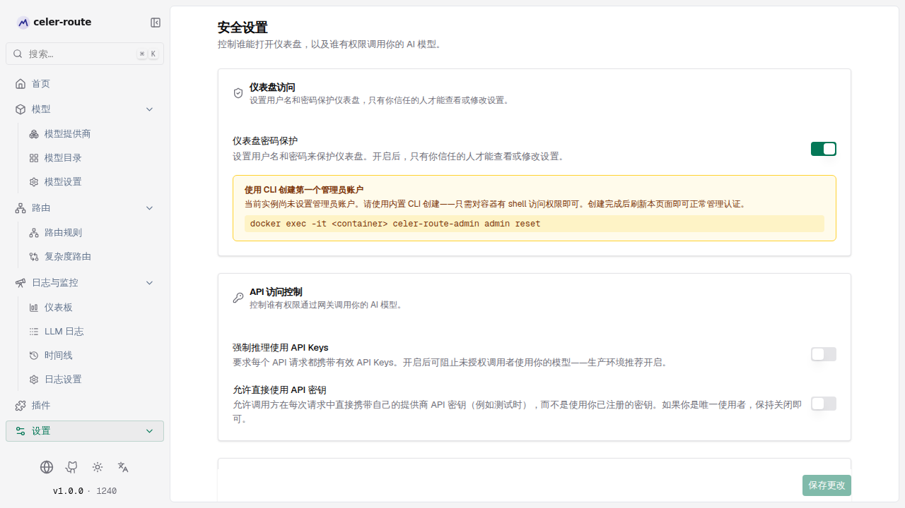
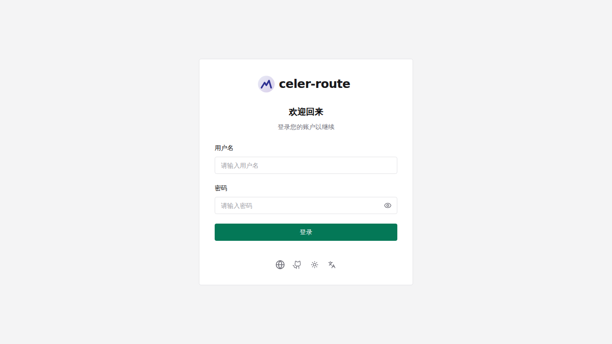
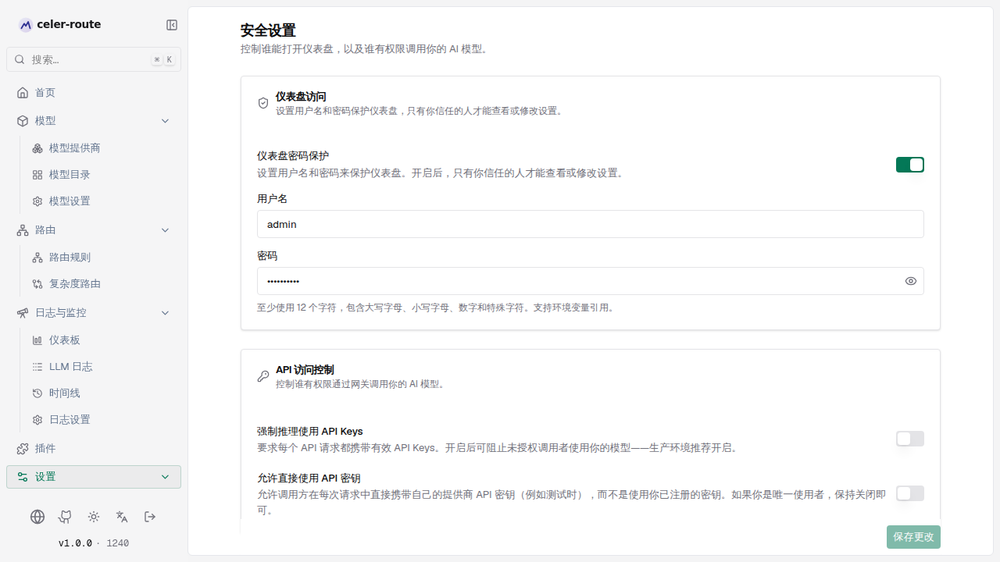

# 仪表盘密码保护

celer-route 的管理仪表盘（`http://<host>:8080`）默认无需登录即可访问。开启
**仪表盘密码保护**后，打开仪表盘会先要求登录，`/api/*` 下的所有管理接口也会
要求 HTTP Basic 认证——只有持有管理员凭据的人才能查看或修改设置。

## 工作方式

| 环节 | 说明 |
|------|------|
| **登录页** | 开启后访问任意工作区页面都会跳转到登录页，输入用户名/密码后方可进入 |
| **凭据存储** | 用户名与密码存放在配置存储（SQLite 或 Postgres）；密码以 Argon2id 哈希存储，绝不落盘明文 |
| **密码策略** | 至少 12 个字符，须包含大写、小写、数字、特殊字符——Web UI 与 CLI 共用同一套策略 |
| **两条路径** | 首次创建管理员只能用 CLI（或 setup_token）；创建完成后，日常改密码、开关认证都在 Web UI 完成 |

## 首次设置（CLI）

全新的 celer-route 实例尚无管理员账号时，无法在 Web UI 里直接设密码——因为
创建第一个管理员的接口本身还没被保护。Docker 部署下推荐用内置 CLI 直接写入
管理员记录，无需预配置 `setup_token`。

进入 **设置 → 安全 → 仪表盘访问**，把 **仪表盘密码保护** 开关打开。若尚无
管理员，页面会提示用 CLI 创建：



按提示在宿主机上执行：

```bash
# 1. 启动容器（需有 config_store 配置段）
docker compose up -d

# 2. exec 进入容器并运行 CLI
docker exec -it celer-route \
  celer-route-admin admin reset
```

CLI 会先打印当前状态（无管理员 → 将 CREATE，已有管理员 → 将 RESET 密码），
确认后提示输入用户名与密码，完成后输出：

```
Done.
  Admin username: admin
  Auth enabled:   true
  Next step:      log in to the celer-route dashboard.
  Note:           BIFROST_SETUP_TOKEN / setup_token is no longer required for this node.
```

回到浏览器刷新 **安全** 页面，即可看到用户名/密码管理表单；打开
`http://localhost:8080` 会显示登录页：



### 脚本 / CI 用法

在流水线中用三个 flag 免交互驱动 CLI（stdin 不是 TTY 时必须用
`--password-stdin`，以防密码泄漏到进程列表或 CI 日志）：

```bash
docker exec -i celer-route \
  celer-route-admin admin reset \
  --username admin \
  --password-stdin \
  --yes \
  <<< $'NewPassword123!\nNewPassword123!\n'
```

- `--username` — 跳过用户名提示
- `--password-stdin` — 从 stdin 读两行（密码、确认密码），非 TTY 时必需
- `--yes` — 跳过 `[y/N]` 确认

## 日常管理（Web UI）

管理员创建后，所有日常操作都在 **设置 → 安全 → 仪表盘访问** 完成，无需再用
CLI：



- **开关仪表盘密码保护** — 顶部开关；关闭后仪表盘与 `/api/*` 不再要求认证
- **改用户名 / 密码** — 直接在用户名、密码输入框修改，点 **保存更改**；密码
  框会就地校验是否符合策略（12+ 字符、大小写、数字、特殊字符）
- **退出登录** — 侧边栏底部的 **退出登录** 按钮

:::note
CLI 创建的管理员已把 `is_enabled` 设为 `true`，所以仪表盘认证在 CLI 运行
成功后即处于开启状态。如需临时关闭，在 Web UI 关掉开关即可。
:::

## CLI 参考

```
celer-route-admin admin reset [flags]

Flags:
  --config PATH        celer-route config.json 路径。省略时使用
                       <app-dir>/config.db 下的默认 SQLite 数据库
  --app-dir PATH       应用数据目录（默认：$APP_DIR 环境变量，或当前目录）；
                       仅在未提供 --config 时使用
  --username NAME      跳过用户名提示并使用 NAME
  --password-stdin     从 stdin 而非终端读取密码（及确认密码）
  --yes                跳过交互式确认提示
```

在 Docker 容器内通常无需任何 flag——CLI 默认用容器内的 `config.db`，直接
`celer-route-admin admin reset` 即可。

## 安全说明

- CLI **不打开**任何网络监听，只读写 `config.json` 声明的配置存储（SQLite 文件
  或 Postgres DSN）。
- 运行 CLI 所需的 shell 权限与 `cat config.json` 相同——能读后者的人本就能读
  现有管理员哈希，因此 CLI 不增加新的攻击面。
- 多节点部署：共享 Postgres 后端时只需在一个节点运行一次（记录是唯一事实来源）；
  各节点独立 SQLite 时，需在每个节点上对其本地 `config.db` 各运行一次。

## 常见场景

- **忘记密码** → 用 `celer-route-admin admin reset` 重置（会 RESET 已有管理员
  密码，用户名可保持不变）
- **想临时关闭登录** → Web UI 安全页关掉 **仪表盘密码保护** 开关
- **CI 自动化初始化** → 用 `--username` + `--password-stdin` + `--yes` 三连，
  把密码通过 stdin 传入，不落命令行
- **首次打开开关却看到 CLI 提示** → 正常，此时尚无管理员，按提示用 CLI 创建
  后刷新页面即可