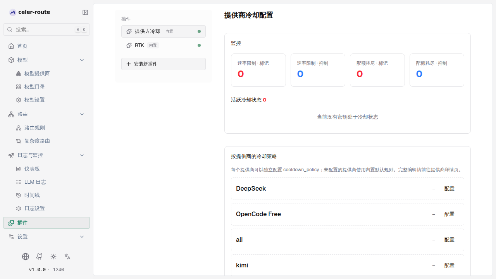
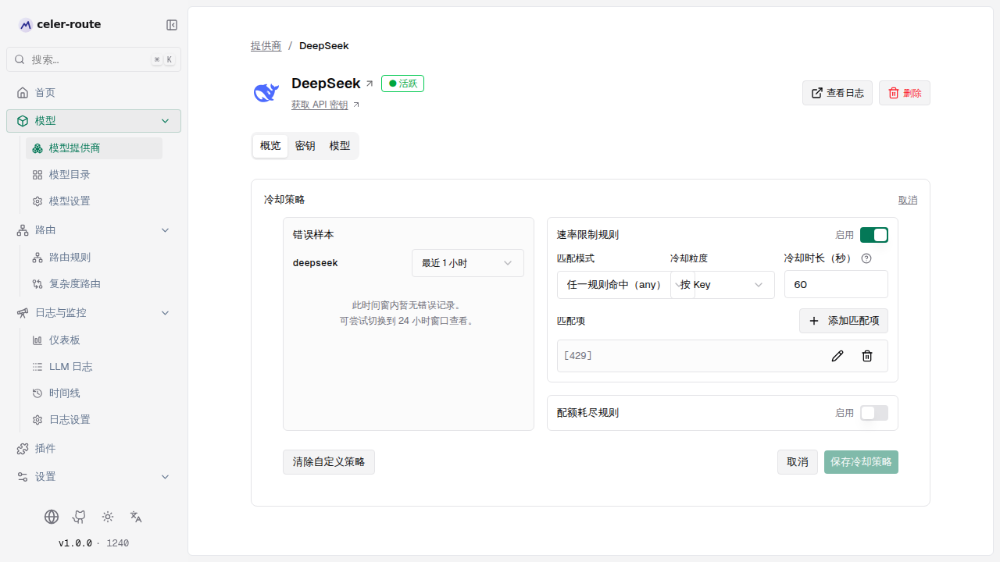

# 提供商冷却

**提供商冷却（Provider Cooldown）**是 celer-route 内置的一项自动化保护：当某个
提供商密钥返回配额耗尽或限流错误时，插件会把它**暂时移出密钥池**，让后续请求
自动改走其他健康密钥，而不是反复撞同一堵墙。冷却时长到期后，密钥自动恢复。

你不需要写任何配置文件——所有操作都可以在 Web UI 中完成：

- **监控**：实时查看哪些密钥正在冷却、为何冷却、何时恢复
- **解除冻结**：觉得某个密钥恢复时机不对时，手动一键解除
- **按提供商配置规则**：决定什么样的错误触发冷却、冷却多久、按 Key 还是按模型

## 工作原理

| 环节 | 说明 |
|------|------|
| **什么会触发冷却** | 请求失败后，插件对错误的**消息、编码、类型**做不区分大小写的匹配（内置模式：`insufficient_quota`、`quota exceeded`、`quota_exceeded`、`billing`、`usage limit`），并受状态码约束：HTTP 429 及其他 4xx 在文案命中时触发；**HTTP 402 与 5xx 永不触发**。 |
| **冷却期间的影响** | 触发失败的 `(provider, key)` 在冷却时长（默认 300 秒）内被跳过选钥，请求落到同一提供商的其他健康密钥，再按顺序回退到其他提供商。若所有可用密钥都在冷却，请求返回合成错误 `429 no_eligible_keys`，并带 `Retry-After` 响应头提示最早可重试的时间。 |
| **如何恢复** | TTL 到期自动恢复，无需人工干预。冷却状态存放在**进程内存**中，重启 celer-route 会清空全部冷却记录。 |

## 启用 / 停用冷却

进入 **左侧边栏 → 插件**，选择 **提供方冷却**：

1. 找到 **启用提供商冷却** 开关，打开即可启用（默认已启用）
2. 关闭开关即全局停用

## 监控冷却状态

插件页的 **监控** 面板每 5 秒自动刷新，两块内容：

**统计卡片**（4 个计数）
- **速率限制 · 标记 / 抑制**、**配额耗尽 · 标记 / 抑制**
- *标记* = 累计触发的次数；*抑制* = 累计被拦截（跳过选钥）的请求数

**活跃冷却状态**
- 列出当前正在冷却的每个条目：提供商、密钥 ID、冷却原因（速率限制 / 配额耗尽）、
  **过期时间**（本地时区 + 相对倒计时）
- 每个条目右侧有 **解除冻结** 按钮，点击后该密钥立即回到密钥池，无需等 TTL 到期
  （keyless 提供商不显示该按钮）

## 配置冷却策略

冷却规则是**按提供商独立配置**的。每个提供商要么使用**内置默认策略**（开箱即用，
无需任何配置），要么自定义。

### 进入方式

- **方式一**：插件页 → **按提供商的冷却策略** 列表，点某提供商的 **编辑 / 配置**
- **方式二**：**左侧边栏 → 模型提供商** → 进入某提供商详情页 → 概览 → **冷却策略**
  → **编辑**

### 表单结构

**错误样本（左栏）** —— 不用猜错误长什么样
- 时间窗切换 **最近 1 小时 / 最近 24 小时**，列出该提供商此前的真实错误
- 每条错误样本可点 **应用**，选择加入 *速率限制规则* 或 *配额耗尽规则*，
  自动生成匹配项（状态码 / 错误类型 / 错误代码 / 消息片段）

**规则编辑器（右栏）** —— 速率限制规则 + 配额耗尽规则，每条规则包含：

| 字段 | 说明 |
|------|------|
| **启用** | 开关；两个开关都关闭（或全部留空）保存后，即回退到内置默认策略 |
| **匹配模式** | 任一规则命中（any）/ 所有规则都命中（all） |
| **冷却粒度** | **按 Key**（默认）：一次命中冷却整个 `(provider, key)`。**按模型**：只冷却 `(provider, key, model)`，适合提供商按模型分别限流（如按模型 TPM/RPM），避免一个模型打满拖垮同 key 的其他模型 |
| **冷却时长（秒）** | 命中后进入冷却的秒数（1–86400），冷却期间不会被选钥 |
| **匹配项** | 一条或多条匹配条件，命中即触发：HTTP 状态码、消息包含、错误类型、错误代码；点 **+ 添加匹配项** 增加，铅笔图标编辑，删除图标移除 |

### 保存与回退

- **保存冷却策略**：应用自定义策略；保存后插件页会展示该提供商的规则摘要与
  实时统计
- **清除自定义策略**：一键恢复内置默认策略
- 规则编辑借助 Zod 校验，非法输入会就地提示，无法保存

## 内置默认策略

任何提供商在未自定义策略时，都会套用针对其错误语义调校过的内置默认值——例如
OpenAI 限流冷却 60 秒、配额冷却 600 秒；Anthropic / Gemini / Vertex 限流冷却
60 秒；通用默认 300 秒。**开箱即有保护，无需配置。**

## 常见场景

- **某 Key 总报配额耗尽** → 插件页监控里确认它正处于冷却，去该提供商详情页把
  配额规则的冷却时长调大，并把冷却粒度设为 **按 Key**
- **同 Key 多模型互相拖累** → 把冷却粒度改为 **按模型**，一个模型限流不再影响
  同一 Key 下的其他模型
- **手动干预** → 冷却中的密钥若已恢复（如刚充值），直接在插件页监控里点
  **解除冻结**