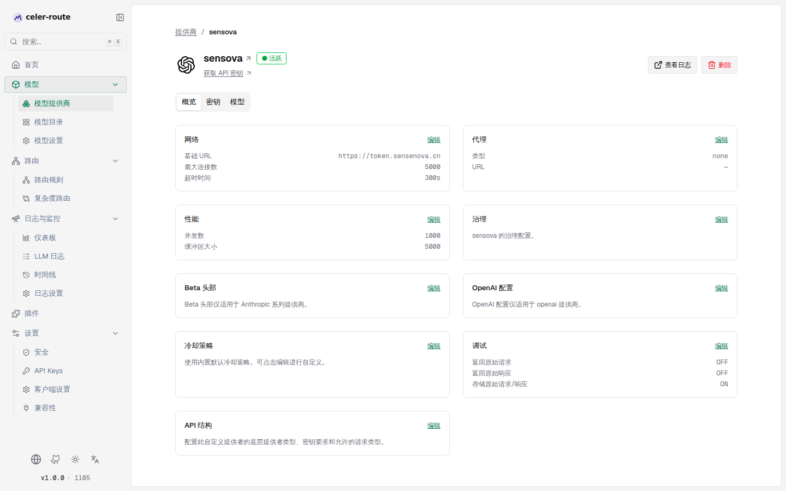
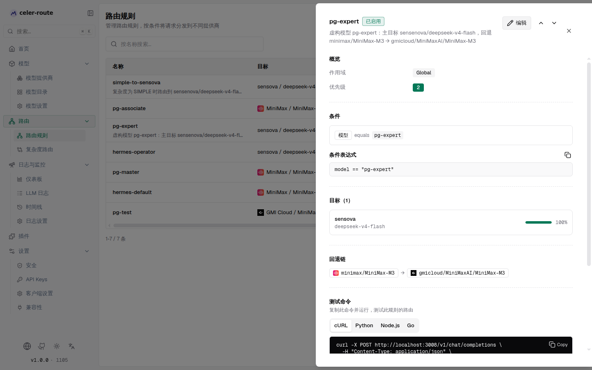
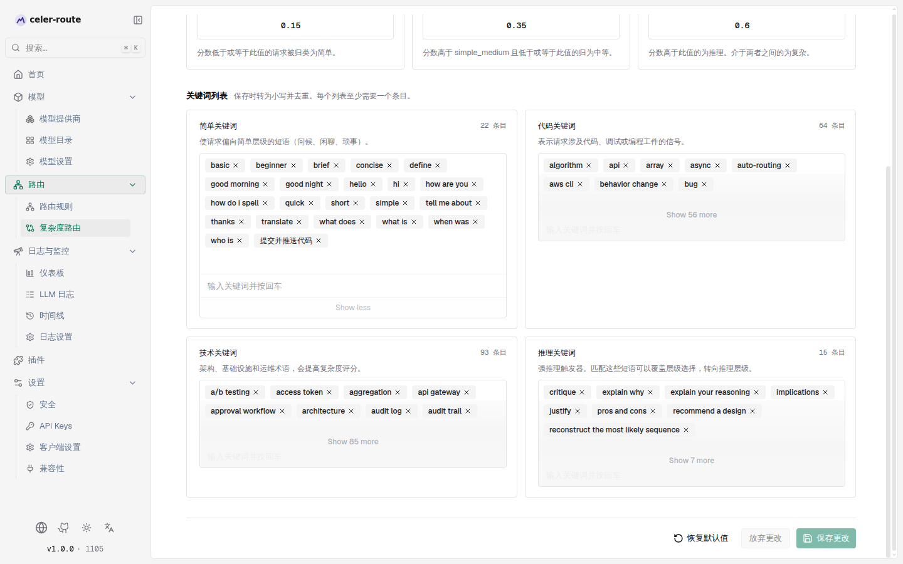
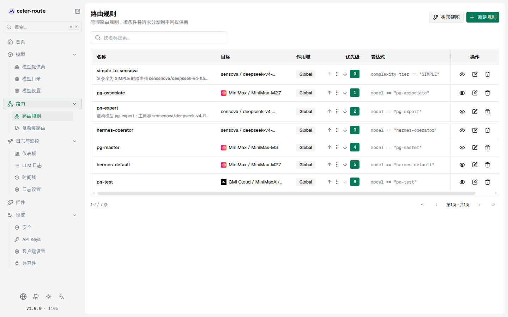
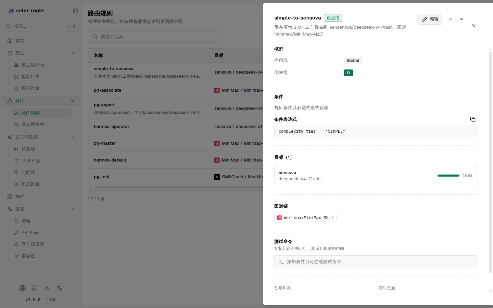

# 路由规则示例

本文通过两个完整场景，演示如何从零配置 celer-route 的路由规则。每个场景都包含具体的操作步骤和
字段值，你可以照着在自己的实例中复现。

:::tip[前置阅读]
如果还不了解路由规则的基本概念（作用域、优先级、加权目标、链式规则、回退链），
请先阅读 [路由规则](./routing.mdx)。
:::

---

## 场景一：虚构模型 `pg-expert` 按条件路由

**目标**：虚构一个模型名 `pg-expert`，当请求中的 `model` 字段等于 `pg-expert` 时，将请求路由到
sensova 的 `deepseek-v4-flash` 模型；如果 sensova 失败，依次回退到 minimax 的 `MiniMax-M3` 和
GMI Cloud 的 `MiniMaxAI/MiniMax-M3`。同时为 sensova 提供商配置两个 API 密钥、失败重试两次、
以及 429 错误时冷却 20 秒。

### 第一步：配置 sensova 提供商

进入 **左侧边栏 → 模型提供商 → sensova**，在概览页配置以下三处：

**1.1 添加两个 API 密钥**

1. 点击 **密钥** 标签页
2. 点 **添加密钥**，填入第一个密钥名称和 API Key 值，保存
3. 再次点 **添加密钥**，填入第二个密钥，保存

这样 sensova 提供商就拥有两个密钥，负载均衡会在两者之间轮转；当其中一个被冷却时，另一个
仍可正常使用。

**1.2 配置失败重试两次**

1. 回到 **概览** 标签页，找到 **网络** 区域，点 **编辑**
2. 在网络配置表单中，将 **最大重试次数** 设为 `2`
3. 保存

这样 sensova 提供商的请求在失败后会自动重试最多 2 次，然后才进入回退链。

**1.3 配置 429 冷却 20 秒**

1. 在概览页找到 **冷却策略** 区域，点 **编辑**
2. 在弹出的冷却策略编辑器中：
   - **速率限制规则**：打开 **启用** 开关
   - **冷却粒度**：选择 **按 Key**（每个密钥独立冷却）
   - **冷却时长（秒）**：填入 `20`
   - **匹配项**：点 **添加匹配项**，在 **HTTP 状态码** 字段填入 `429`
3. 点 **保存冷却策略**

配置后，sensova 的某个密钥收到 HTTP 429 时，该密钥会被冷却 20 秒，期间请求自动落到另一个
健康密钥；两个密钥都在冷却时，请求进入回退链。

### 第二步：创建路由规则 `pg-expert`

进入 **左侧边栏 → 路由 → 路由规则**，点 **新建规则**，按三步向导填写：

**基本信息**

| 字段 | 值 |
|------|-----|
| 规则名称 | `pg-expert` |
| 描述 | 虚构模型 pg-expert：主目标 sensova/deepseek-v4-flash，回退 minimax/MiniMax-M3 → gmicloud/MiniMaxAI/MiniMax-M3 |
| 启用规则 | 打开 |
| 链式规则 | 关闭 |
| 作用域 | 全局（Global） |
| 优先级 | `2`（或其他未占用的数值） |

**匹配条件**

切换到 **匹配条件** 步骤，在可视化构建器中添加一条规则：

- 字段选择 **模型**
- 运算符选择 **equals**（等于）
- 值填入 `pg-expert`

构建器底部的表达式预览会显示：`model == "pg-expert"`

**目标与回退**

切换到 **目标与回退** 步骤：

路由目标（1 个）：

| 提供商 | 模型 | 权重 |
|--------|------|------|
| sensova | deepseek-v4-flash | 1 |

回退（2 条，按顺序）：

| 顺序 | 提供商 | 模型 |
|------|--------|------|
| 第 1 回退 | minimax | MiniMax-M3 |
| 第 2 回退 | gmicloud | MiniMaxAI/MiniMax-M3 |

点 **保存规则**。

### 效果验证

保存后，在规则列表中点击 `pg-expert` 的 **查看** 按钮，可以在详情面板中确认完整配置：

详情面板展示了：
- **条件**：`model == "pg-expert"`
- **目标**：sensova / deepseek-v4-flash，权重 100%
- **回退链**：`minimax/MiniMax-M3` → `gmicloud/MiniMaxAI/MiniMax-M3`
- **测试命令**：自动生成的 cURL 命令，用 `model: "pg-expert"` 发起请求即可验证路由效果

当客户端发送 `model: "pg-expert"` 的请求时，celer-route 会：
1. 匹配到这条规则
2. 将请求路由到 sensova 的 `deepseek-v4-flash`（在两个密钥间负载均衡，失败重试 2 次）
3. 如果 sensova 仍然失败，依次尝试 minimax/MiniMax-M3 → gmicloud/MiniMaxAI/MiniMax-M3

---

## 场景二：按复杂度路由

**目标**：当请求中包含「提交并推送代码」关键词时，将复杂度判定为 SIMPLE；然后创建一条最高优先级
的路由规则，当复杂度为 SIMPLE 时，把请求路由到 sensova 的 `deepseek-v4-flash`，回退到 minimax
的 `MiniMax-M2.7`。

### 第一步：配置复杂度路由关键词

进入 **左侧边栏 → 路由 → 复杂度路由**，在 **关键词列表** 区域找到 **简单关键词**：

1. 在 **简单关键词** 的输入框中输入 `提交并推送代码`，按回车添加
2. 关键词列表条目数会从 21 增加到 22
3. 点 **保存更改**

添加后，当请求中包含「提交并推送代码」时，复杂度分析器会将其偏向简单层级。配合默认的层级边界
（简单 → 中等 = 0.15），这类请求有很大概率被归类为 `SIMPLE`。

### 第二步：创建复杂度路由规则

回到 **左侧边栏 → 路由 → 路由规则**，点 **新建规则**：

**基本信息**

| 字段 | 值 |
|------|-----|
| 规则名称 | `simple-to-sensova` |
| 描述 | 复杂度为 SIMPLE 时路由到 sensova/deepseek-v4-flash，回退 minimax/MiniMax-M2.7 |
| 启用规则 | 打开 |
| 链式规则 | 关闭 |
| 作用域 | 全局（Global） |
| 优先级 | `0`（最高优先级） |

:::note[优先级冲突]
每个作用域内优先级数值必须唯一。如果 `0` 已被占用，可以先在规则列表中拖拽或用上移 / 下移
按钮调整已有规则的顺序来腾出 `0` 的位置，再创建新规则。
:::

**匹配条件**

切换到 **匹配条件** 步骤。由于 `complexity_tier` 是一个动态字段，可视化构建器中没有预设的
快捷示例，这里需要切换到 **手写表达式** 模式：

1. 点击 **手写表达式** 标签
2. 在表达式输入框中填入：`complexity_tier == "SIMPLE"`

:::tip[复杂度层级值]
复杂度路由器分配的层级值是大写的枚举字符串：`SIMPLE`、`MEDIUM`、`COMPLEX`、`REASONING`。
在 CEL 表达式中必须用大写匹配。
:::

**目标与回退**

切换到 **目标与回退** 步骤：

路由目标（1 个）：

| 提供商 | 模型 | 权重 |
|--------|------|------|
| sensova | deepseek-v4-flash | 1 |

回退（1 条）：

| 顺序 | 提供商 | 模型 |
|------|--------|------|
| 第 1 回退 | minimax | MiniMax-M2.7 |

点 **保存规则**。

### 效果验证

保存后，两条规则都出现在规则列表中。`simple-to-sensova` 排在优先级 0（最上方），`pg-expert`
排在优先级 2：

点击 `simple-to-sensova` 的 **查看** 按钮，确认详情：

详情面板展示了：
- **条件**：`complexity_tier == "SIMPLE"`（以表达式形式存储，因为手写表达式模式不生成可视化条件树）
- **目标**：sensova / deepseek-v4-flash，权重 100%
- **回退链**：`minimax/MiniMax-M2.7`

当客户端发送的请求中包含「提交并推送代码」时，celer-route 会：
1. 复杂度路由器将请求归类为 `SIMPLE`，填入 `complexity_tier` 字段
2. 路由引擎按优先级从高到低评估，`simple-to-sensova`（优先级 0）首先匹配
3. 请求被路由到 sensova 的 `deepseek-v4-flash`
4. 如果 sensova 失败，回退到 minimax 的 `MiniMax-M2.7`

---

## 两条规则的协同关系

| 请求特征 | 匹配的规则 | 路由目标 | 回退链 |
|----------|-----------|----------|--------|
| `model == "pg-expert"` | pg-expert（优先级 2） | sensova / deepseek-v4-flash | minimax/MiniMax-M3 → gmicloud/MiniMaxAI/MiniMax-M3 |
| 包含「提交并推送代码」→ 复杂度 SIMPLE | simple-to-sensova（优先级 0） | sensova / deepseek-v4-flash | minimax/MiniMax-M2.7 |
| 既不含关键词也不是 pg-expert | 无规则匹配 | 原样路由到请求指定的提供商/模型 | 无 |

由于 `simple-to-sensova` 的优先级（0）高于 `pg-expert`（2），如果一条请求同时满足两个条件
（model 是 pg-expert 且复杂度是 SIMPLE），`simple-to-sensova` 会先匹配并生效。如需让
`pg-expert` 在两者同时满足时优先，可以将 `pg-expert` 的优先级调到更低（数值更小）。
