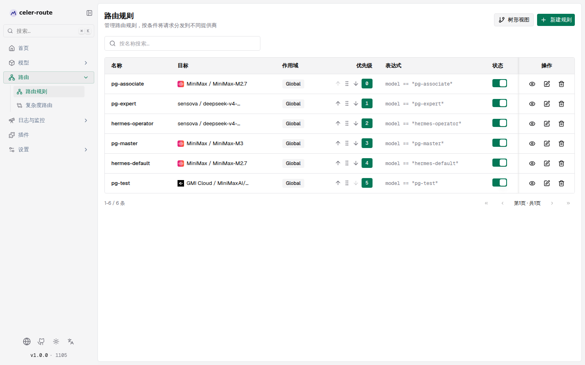
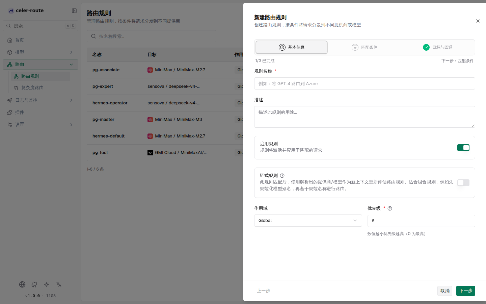
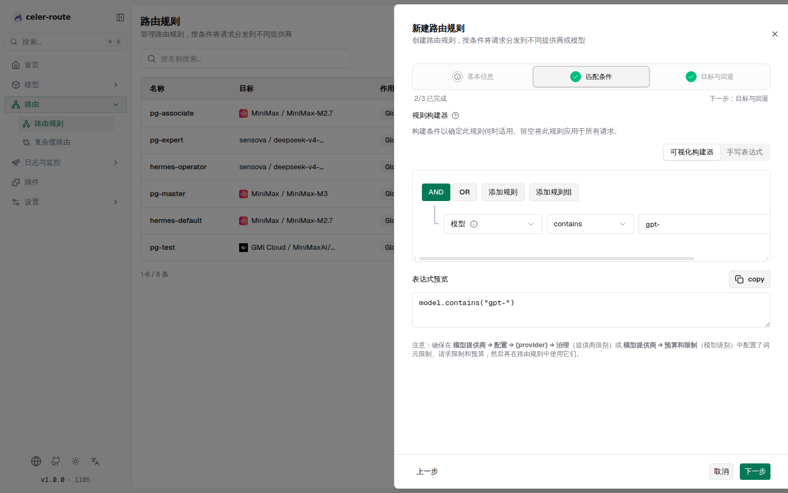
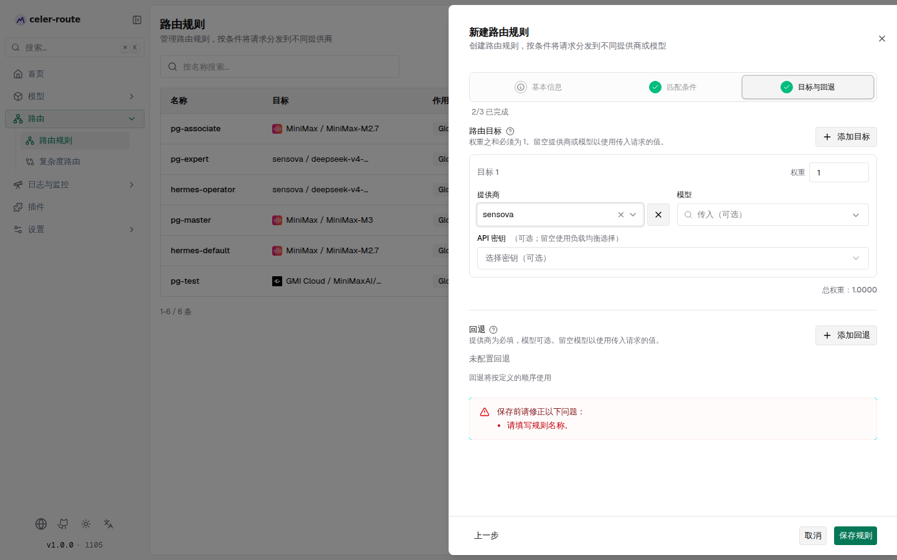
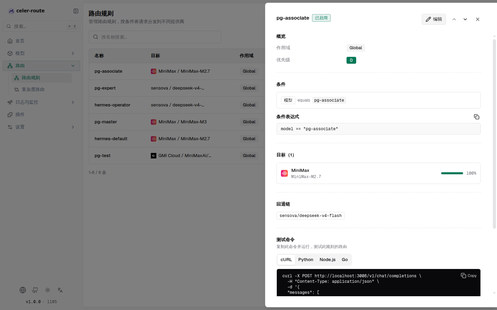
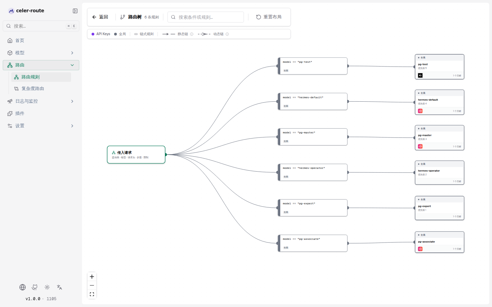
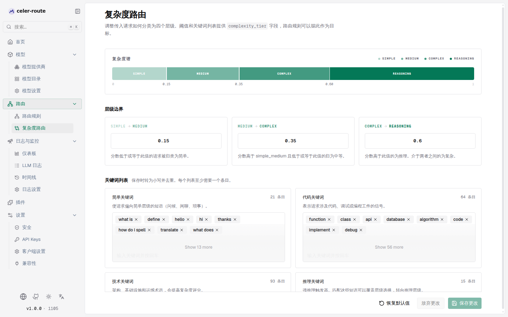

# 路由规则

**路由规则（Routing Rules）** 是 celer-route 内置的智能请求分发能力：当一条请求满足你设定的
条件时，celer-route 会把它路由到你指定的提供商、模型甚至密钥，而不是走默认的上游。你可以：

- **按条件分流**：根据模型名、提供商、请求类型、请求头、查询参数、预算用量等条件匹配请求
- **加权分发**：一条规则可以配置多个目标，按权重比例随机分配流量
- **链式规则**：先规范化模型别名，再基于规范名称做二次路由
- **回退链**：主目标失败时按顺序尝试备用提供商/模型
- **可视化决策树**：用树形视图纵览所有规则的匹配路径与目标

所有操作都在 Web UI 中完成，无需手写配置文件。

## 工作原理

| 环节 | 说明 |
|------|------|
| **何时触发** | 每条 LLM 请求在通过治理检查后、发给上游提供商之前，路由引擎会按**作用域优先级 → 优先级数值**的顺序逐条评估规则。第一条匹配的规则生效。 |
| **作用域优先级** | 虚拟密钥（Virtual Key） > 用户（User） > 团队（Team） > 客户（Customer） > 全局（Global）。高优先级作用域里的规则先评估；同一作用域内按优先级数值从小到大排列（0 为最高）。 |
| **匹配条件** | 条件以 CEL 表达式存储。支持可视化构建器（拖拽组合条件）和手写表达式两种模式。条件留空表示匹配所有请求。 |
| **目标选择** | 匹配后，从规则配置的多个目标中按**权重随机**选择一个。权重之和要求为 1。目标中留空提供商/模型表示沿用传入请求的原始值。 |
| **链式规则** | 开启「链式规则」后，匹配出的提供商/模型会作为新输入重新评估整条作用域链，直到没有规则匹配、遇到终止规则、所有链式规则都已触发过、或达到最大深度（默认 10）。适合「先别名归一化 → 再按实际模型路由」的组合场景。 |
| **回退链** | 当选中目标的提供商请求失败时，按回退链定义的顺序依次尝试备用提供商/模型。 |
| **无规则时** | 没有任何路由规则匹配时，请求原样发给传入请求指定的提供商和模型，不做任何改写。 |

## 管理路由规则

进入 **左侧边栏 → 路由 → 路由规则**：

- 规则列表每 5 秒自动刷新，展示每条规则的名称、目标摘要、作用域、优先级、表达式和启用状态
- 顶部可按名称搜索，支持分页（每页 25 条）
- 每行可拖拽调整顺序（或用上移 / 下移按钮），拖拽后优先级数值自动重新分配
- 每行有**启用开关**（切换即时生效）、**查看**、**编辑**、**删除**按钮

## 创建 / 编辑规则

点击 **新建规则**（或编辑某条规则），会从右侧滑出分三步的向导面板：

### 第一步：基本信息

| 字段 | 说明 |
|------|------|
| **规则名称** | 必填，用于列表和日志中识别。例如「将 GPT-4 路由到 Azure」 |
| **描述** | 可选，说明此规则的用途 |
| **启用规则** | 开关。关闭后规则不参与评估。列表中的开关可随时切换 |
| **链式规则** | 开关。开启后，此规则匹配出的提供商/模型会作为新输入重新评估路由规则。适合组合规则（如先规范化模型别名，再按规范名称路由） |
| **作用域** | **全局**（对所有请求生效）或 **虚拟密钥**（仅对选定的 API 密钥生效）。选虚拟密钥时需指定一个 API 密钥 |
| **优先级** | 必填，0–1000 的整数。数值越小优先级越高（0 为最高）。同一作用域内按此值升序评估 |

### 第二步：匹配条件

条件构建器支持两种模式，可随时切换：

- **可视化构建器**：拖拽组合条件，无需写代码。留空表示匹配所有请求
- **手写表达式**：直接编写 CEL 表达式，适合高级条件

可视化构建器可用的匹配字段分为三组：

| 分组 | 字段 | 说明 |
|------|------|------|
| 请求属性 | **模型** | 按请求的模型名称匹配。支持精确值、列表、包含、前缀/后缀以及正则表达式 |
| | **提供商** | 按处理请求的上游提供商匹配 |
| | **请求类型** | 按 API 请求类型（聊天、文本、嵌入、图像、音频等）过滤。流式与非流式请求属于不同类型 |
| | **复杂度层级** | 按复杂度路由器分配的层级（简单、中等、复杂、推理）路由（详见下文「复杂度路由」） |
| 元数据 | **请求头** | 按传入的 HTTP 请求头匹配，使用小写请求头名称 |
| | **URL 查询参数** | 按请求 URL 的查询字符串参数匹配 |
| 用量与预算 | **词元用量 (%)** | 按词元用量百分比检查，对照模型和提供商配置中的上限 |
| | **请求用量 (%)** | 按请求用量百分比检查 |
| | **预算用量 (%)** | 按预算用量百分比检查 |

:::note[用量与预算条件]
使用 `tokens_used`、`request`、`budget_used` 字段前，请先在 **模型提供商 → 配置 → 治理**（提供商级别）
或 **模型提供商 → 预算和限制**（模型级别）中配置好词元限制、请求限制和预算，否则这些字段始终为 0。
:::

构建器底部有**表达式预览**，实时展示当前条件对应的 CEL 表达式。也可以点击快捷示例
（如「模型包含 "gpt-"」「提供商为 OpenAI」「聊天补全」）快速插入条件。

### 第三步：目标与回退

**路由目标**（至少一个）：

| 字段 | 说明 |
|------|------|
| **提供商** | 请求路由到的目标提供商。留空表示沿用传入请求的提供商 |
| **模型** | 请求路由到的目标模型。留空表示沿用传入请求的模型 |
| **API 密钥** | 可选。固定使用某个密钥（留空则由负载均衡选择） |
| **权重** | 此目标接收的请求比例，所有目标的权重之和必须为 1 |

底部显示**总权重**，不为 1 时可用「归一化权重至 1」一键修正。点 **添加目标** 增加更多目标。

**回退**（可选）：当所有目标都失败时，按定义的顺序依次尝试回退提供商/模型。每条回退
提供商必填、模型可选（留空则沿用传入请求的值）。可拖拽调整回退顺序。

## 查看规则详情

在列表中点击某条规则的**查看**按钮（或点击行），从右侧滑出规则详情面板：

详情面板包含：

- **概览**：作用域、优先级
- **条件**：以可视化方式展示匹配条件，同时显示 CEL 表达式原文（可复制）
- **目标**：每个目标的提供商、模型、权重百分比，以及固定的密钥（如有）
- **回退链**：按顺序展示回退提供商/模型
- **测试命令**：根据规则条件自动生成 cURL / Python / Node.js / Go 测试命令，复制后即可运行
  来验证此规则的路由效果。如果开启了身份验证，可选择一个虚拟密钥来生成带认证的命令

## 树形视图

点击规则列表顶部的 **树形视图**，进入只读的决策树可视化：

树形视图以**从左到右**的流程展示整套路由决策：

- 最左侧是**传入请求**节点（提供商 · 模型 · 请求头 · 参数 · 限制）
- 中间是**条件节点**，多条规则共享相同的前缀条件时会合并为并行路径
- 右侧是**规则节点**，显示规则名称、作用域颜色标记和目标数量
- 链式规则的回路用虚线边表示，分为**静态链**（重入点已通过静态分析证明）和**动态链**（条件性重入）

顶部工具栏可搜索条件或规则、重置布局。节点可拖拽自由摆放，位置会自动保存到浏览器；
点击节点可高亮其上下游完整路径。

## 复杂度路由

**复杂度路由**是路由规则的一个配套能力，位于 **左侧边栏 → 路由 → 复杂度路由**：

复杂度路由器会把每条传入请求分类为四个层级之一：**简单（Simple）、中等（Medium）、复杂（Complex）、
推理（Reasoning）**，并将结果填入路由规则的 `complexity_tier` 字段。这样你就可以在路由规则里按
复杂度做分流——例如把推理类请求路由到更强的模型。

分类依据两部分：

- **层级边界**：三个阈值（简单 → 中等、中等 → 复杂、复杂 → 推理）把复杂度分数切分为四段
- **关键词列表**：四组关键词（简单、代码、技术、推理），匹配到会提高或覆盖复杂度评分

页面可调整阈值和关键词列表，支持**恢复默认值**和**放弃更改**。保存后即对后续请求生效。

## 默认行为

- 没有任何路由规则时，请求原样发给传入请求指定的提供商和模型——**开箱即用，无需配置**
- 新建规则时优先级默认为「当前最大值 + 1」，排在已有规则之后
- 链式规则的最大深度默认 10，防止无限循环
- 路由引擎的评估过程会写入请求日志，可在 **LLM 日志** 或 **时间线** 中查看每一步的匹配与决策

## 常见场景

- **模型别名归一化** → 创建一条链式规则，把别名 `gpt-4` 映射到真实提供商/模型；再创建第二条
  规则按真实模型名路由到不同目标。链式规则会自动接力
- **按模型分流** → 条件设为「模型包含 "gpt-"」，目标设为 Azure OpenAI 的对应模型，其余请求走默认
- **加权负载均衡** → 一条规则配多个目标（如 70% 走 OpenAI、30% 走 Azure），权重之和为 1
- **按预算切换** → 条件设为「预算用量 (%) > 80」，目标切到更便宜的提供商，避免超支
- **按请求头路由** → 条件设为 `headers["x-route-to"] == "canary"`，金丝雀流量走指定提供商
- **按复杂度路由** → 先在复杂度路由页调好阈值和关键词，再在路由规则里用 `complexity_tier == "reasoning"`
  把推理类请求路由到推理模型
