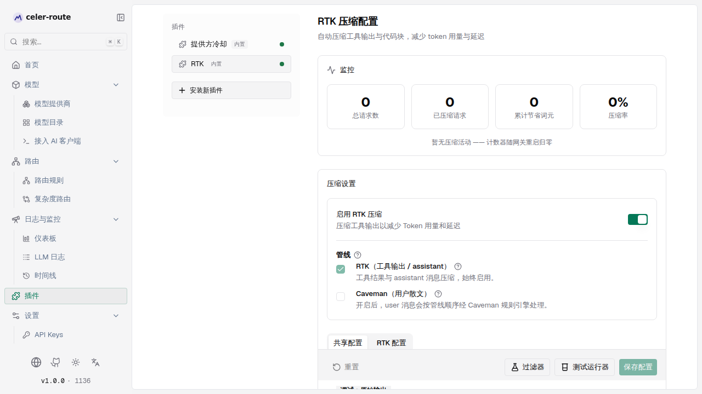
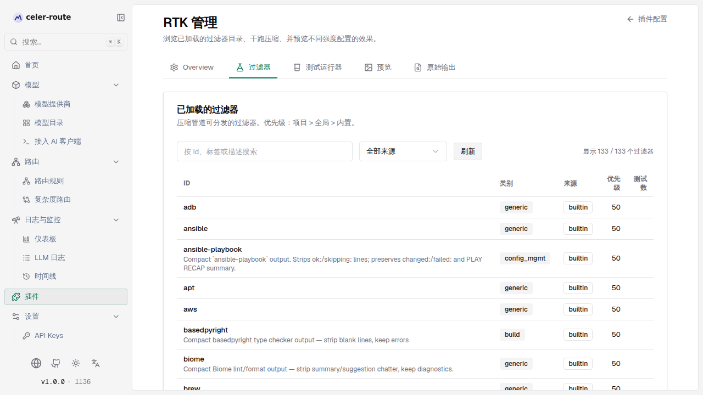
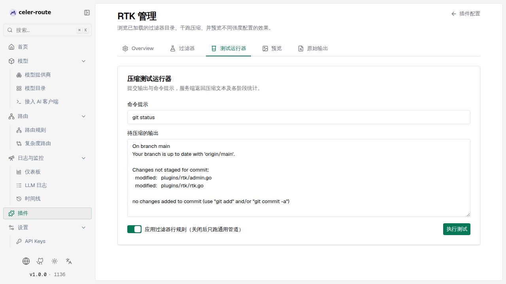

# RTK 压缩

**RTK（Rule-based Tool-output Kompression）**是 celer-route 内置的上下文压缩插件。
在每次 LLM 请求前，它会自动压缩工具输出（`tool_result`）与代码块，把冗长的执行
结果变小，从而降低 Token 用量、缩短延迟；请求回来后，它还会把响应里的 Token
用量校正为压缩后的真实值，保证计费与统计准确。

你无需改客户端代码——压缩对模型透明，且**失败开放**：压缩一旦出错就回退原文，
永不破坏请求。

## 工作原理

| 环节 | 说明 |
|------|------|
| **请求前压缩** | 请求发给模型前，扫描消息中的工具输出与代码块，套用压缩管线（去重、智能截断、近似行分组、行级过滤、语义渲染），减小体积 |
| **请求后校正** | 模型返回后，把响应里的 prompt token 数改写为压缩后的值，并写入原始 / 压缩两组计数，供计费与日志读取 |
| **失败开放** | 任一压缩步骤出错都回退原文，请求照常发出；不会因压缩把请求弄坏 |
| **管线引擎** | 固定顺序 **RTK → Caveman**。RTK 作用于工具结果与 assistant 消息，插件启用时始终开启；Caveman 作用于 user 消息的散文，默认关闭，可勾选启用 |
| **原始输出可恢复** | 被压缩的工具输出会在末尾嵌入一个免鉴权恢复链接（`GET /api/context/rtk/raw-output/<id>`），LLM 需要原文时可自行取回 |

## 启用 / 停用

进入 **左侧边栏 → 插件**，选择 **RTK**：

1. 找到 **启用 RTK 压缩** 开关，打开即启用（默认已启用）
2. 关闭开关即全局停用——所有请求的压缩管线都会被跳过，方便 A/B 对比压缩前后的成本与质量
3. 启用卡片下方是 **管线** 复选框，**RTK（工具输出 / assistant）**始终勾选且不可关闭；**Caveman（用户散文）**默认未勾选，按需启用



## 用预设快速起步

配置页顶部提供 **快速预设**，80% 的场景点一个预设就够了：

| 预设 | 取舍 | 适用 |
|------|------|------|
| **最低** | 保留更多上下文，节省较少 Token | 担心压缩丢关键信息 |
| **标准**（推荐起点） | 通用场景的平衡选择 | 默认值 |
| **激进** | 最大压缩，牺牲部分上下文换取最低 Token | 工具输出很长且模型只抓要点 |

点一个预设会自动填入一组合理参数（行数 / 字符上限、去重阈值、是否分组、最小压缩词元数等），之后仍可在下方逐项微调，再点 **保存配置**。觉得改坏了，点 **撤销预设** 把预设管理的字段回滚到上次保存的值。

预设只管理 7 个最常用字段；其余「调试：原始输出」「智能分组」「高级：管线与阈值」「Caveman」等是**独立高级设置**，不受预设影响。

## 监控压缩效果

插件页 **监控** 面板每 5 秒刷新，4 个汇总指标 + 按引擎细分的累计行：

| 指标 | 含义 |
|------|------|
| **总请求数** | 经过网关的 LLM 请求数 |
| **已压缩请求** | 实际触发压缩的请求数 |
| **累计节省词元** | 压缩前后 prompt token 的差值累计 |
| **压缩率** | 节省量占原始量的比例 |

**分引擎累计指标**（出现 RTK / Caveman 实际调用后才显示）—— 每个引擎一行：调用次数、输入 / 输出字节数、压缩率。

:::note
计数器存放在**进程内存**中，**重启网关会归零**。新启动的网关会显示「暂无压缩活动 —— 计数器随网关重启归零」，这是正常的。
:::

## 微调配置

### 预设管理的字段（7 项）

| 字段 | 含义 | 何时调整 |
|------|------|----------|
| **压缩强度** | 控制激进程度，按比例缩放行数 / 字符上限（最低 ×1.5、标准 ×1.0、激进 ×0.5） | 工具输出很长且模型只抓要点 → 调高；怕丢上下文 → 调低 |
| **每结果最大行数** | 压缩后每个工具结果保留的行数上限（页面会显示「实际生效 N 行」预览缩放后值） | 模型频繁漏掉中段关键信息 → 调高；不需要那么多细节 → 调低 |
| **每结果最大字符数** | 同上，按字符数兜底，防单条结果压满上下文窗口 | 同上 |
| **去重阈值** | 连续相同行达到此值后触发去重 | 工具输出有大量重复行（连续失败、循环打印）→ 调低到 2 或 3 |
| **启用分组 / 分组阈值** | 把「只在时间戳 / 数字 / 版本号上有差异」的连续近似行模糊合并 | 时间序列日志、构建产物列表 → 开启；默认阈值 3 行足够 |
| **最小压缩词元数** | 请求预估词元数低于此值时跳过压缩（0 = 总是压缩） | 小请求想省处理时间 → 调高；agent 工作流都是大请求 → 设为 0 |

### 独立高级设置

| 区块 | 关键字段 | 说明 |
|------|----------|------|
| **智能分组** | 启用分组 / 分组阈值 | 默认由预设管理；展开后可在分组阈值独立调整 |
| **语义压缩** | 启用语义压缩 + 跳过检测类型 | 在行级过滤之后，对结构化输出（git diff、测试套件、terraform plan、JSON 表格）做语义改写；失败开放，开启无风险 |
| **调试：原始输出** | 原始输出保留（从不 / 失败时 / 始终）+ 最大字节数 + 目录 + TTL | 同时也是「LLM 日志详情 → RTK 压缩」标签页压缩前原文的数据来源；想对比压缩前后 → 切到「失败时」或「始终」 |
| **高级：管线与阈值** | 最小压缩词元数 | 同上 |
| **Caveman（自然语言压缩）** | Caveman 强度 + 最小消息长度 + 跳过规则 + 保留模式 | 在「管线」中勾选 Caveman 后才生效；针对 user 角色自然语言做规则式压缩（冗余措辞、客套话、软化量词、冠词等），强度分 Lite / Full / Ultra |

### 共享配置 vs 引擎配置

页面顶部有两个标签页：

- **共享配置**：原始输出相关字段（保留、最大字节数、TTL、目录），对 RTK 与 Caveman 都生效
- **RTK 配置**：RTK 引擎自己的预设 / 行数 / 字符 / 去重 / 分组 / 语义压缩等字段
- （启用 Caveman 后会出现）**Caveman 配置**：Caveman 引擎的强度 / 最小长度 / 跳过规则 / 保留模式

## 验证与调试

配置页底部 **重置 / 过滤器 / 测试运行器 / 保存配置** 一排操作按钮，以及 **改完想看效果？** 区块，提供了几个验证入口，无需改运行时配置即可对比压缩前后：

- **测试运行器**（`/workspace/plugins/rtk/test`）—— 对任意输出跑一遍压缩管线，并排对比原始文本与压缩后的文本，并显示命中的过滤器与各阶段词元数
- **预览**（`/workspace/plugins/rtk/preview`）—— 不改运行时配置，分别对 `rtk` / `stacked` / `off` 三种模式跑一次预览
- **过滤器**（`/workspace/plugins/rtk/filters`）—— 浏览当前已加载的内置 + 项目 + 全局过滤器清单与加载诊断
- **原始输出**（`/workspace/plugins/rtk/raw-output`）—— 按 24 位 hex ID 取回某次请求的脱敏原文



过滤器优先级为 **项目 > 全局 > 内置**。内置过滤器覆盖了常见工具的输出（编译器、类型检查器、测试套件、helm、shellcheck 等），无需配置即可生效。



## 原始输出恢复

当工具输出被压缩后，RTK 会在结果末尾嵌入一个恢复标记，形如：

```
[rtk:raw_output_id=<24位十六进制ID>; orig=<原始大小>; ttl=24h; redacted=true; fetch=GET /api/context/rtk/raw-output/<id>]
```

- 该 **24 位十六进制 ID 即访问凭证**（96 位熵），持有者可免 Authorization 头 `GET` 取回被截断的原文
- 同时 RTK 会在请求的系统消息里注入一段**字节稳定**的恢复提示，告诉模型如何取回原文（该提示跨请求内容固定，不破坏 Anthropic / OpenAI 的提示缓存前缀）
- 原文在磁盘上保留到 **TTL 到期**（默认 24 小时，最多 168 小时 / 一周）后被 janitor 清理

**保留策略**（「调试：原始输出 → 原始输出保留」）决定何时把原文落盘：

| 模式 | 行为 | 建议 |
|------|------|------|
| **从不** | 不持久化，最省磁盘 | 日常稳定运行时使用 |
| **失败时** | 仅压缩失败（回退原文）时落盘 | 排查问题时使用 |
| **始终**（默认） | 每次压缩都落盘，配合恢复链接 | 调试 / 需要 LLM 自助取回原文时 |

**原始输出最大字节数**（默认 1 MB）限制单条落盘大小。**原始输出 TTL（小时）**（默认 24）控制清理周期；设为 0 禁用 janitor，文件永不清理。**原始输出目录**留空用服务端默认 `<appDir>/rtk/raw-output`，设置时必须填绝对路径。

:::note
默认是「始终」，以便每次截断都可恢复。磁盘紧张时可改为「从不」或「失败时」，并把 **原始输出最大字节数** 调低。排查完毕记得改回。
:::

## 默认行为

RTK 开箱即用，无需配置：

- 插件**默认启用**（存储里无任何配置时自动启用 —— 配置全零视为「未显式设置」）
- 强度默认 **标准**，每结果保留 120 行 / 12000 字符，去重阈值 3
- **管线** 默认 RTK 始终开启、Caveman 默认关闭
- 内置数十种过滤器自动生效，无需配置
- 原始输出默认 **始终** 保留，TTL 24 小时，单条上限 1 MB。「LLM 日志详情 → RTK 压缩」标签页的压缩前原文也来自这里，按需切到「失败时」或「始终」即可逐条对比

## 常见场景

- **Agent 工作流 Token 飙升** → 确认「启用 RTK 压缩」已开，把强度调到「激进」，开「启用分组」合并相似日志行
- **压缩后模型漏掉关键信息** → 强度调回「标准」或「最低」，调高「每结果最大行数」
- **排查某次压缩到底丢了什么** → 把「原始输出保留」设为「失败时」或「始终」，去 LLM 日志详情的 RTK 压缩标签页看压缩前后（标签页会按 24-hex ID 拉回原文）；或在「测试运行器」用同款输入复现
- **LLM 需要某条被截断的原文** → 只要保留策略非「从不」，让模型按结果末尾的恢复链接自行 GET 取回
- **user 消息充斥客套话 / 软化量词** → 在「管线」勾选 **Caveman（用户散文）**，把强度设到「Full（均衡）」，让 user 角色文本也走规则压缩
- **想看整条压缩管线跑了哪些阶段** → 去 LLM 日志详情 → RTK 压缩标签页，里面会列出「命中的过滤器」「参与压缩的消息」与各阶段统计
