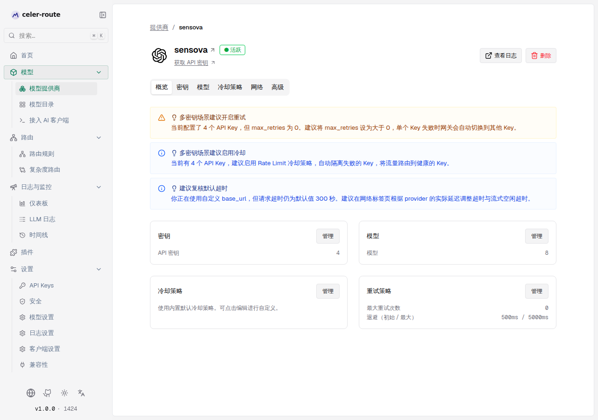
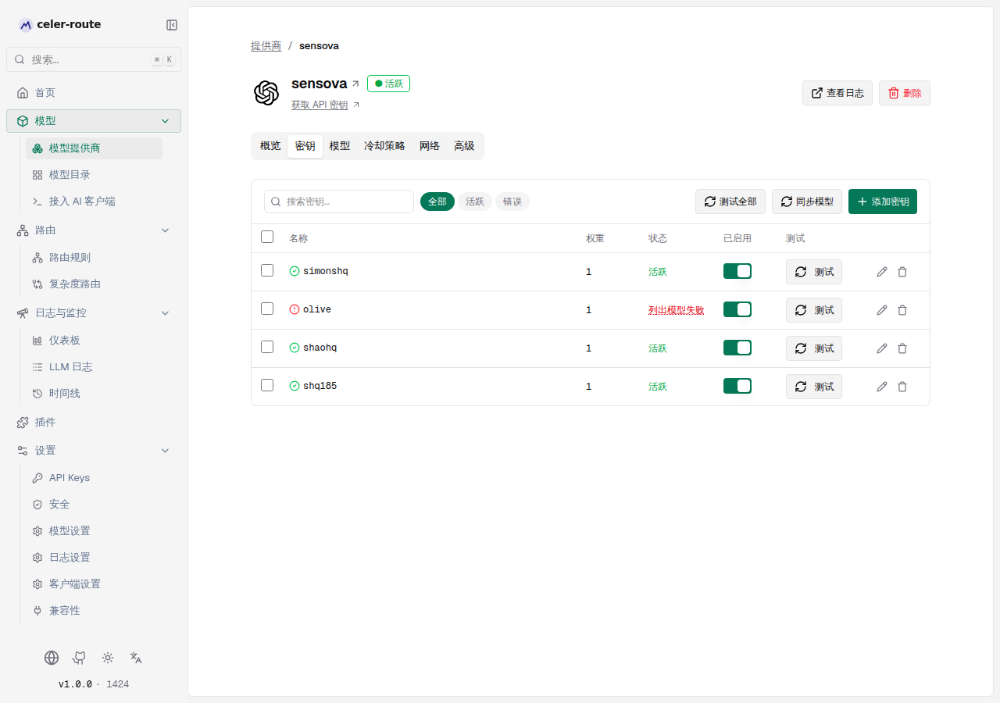
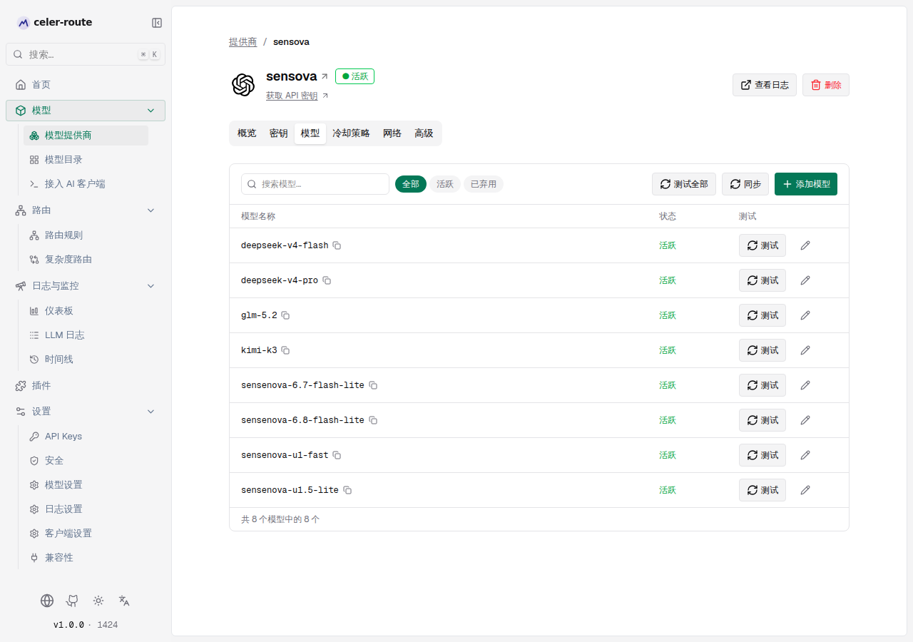
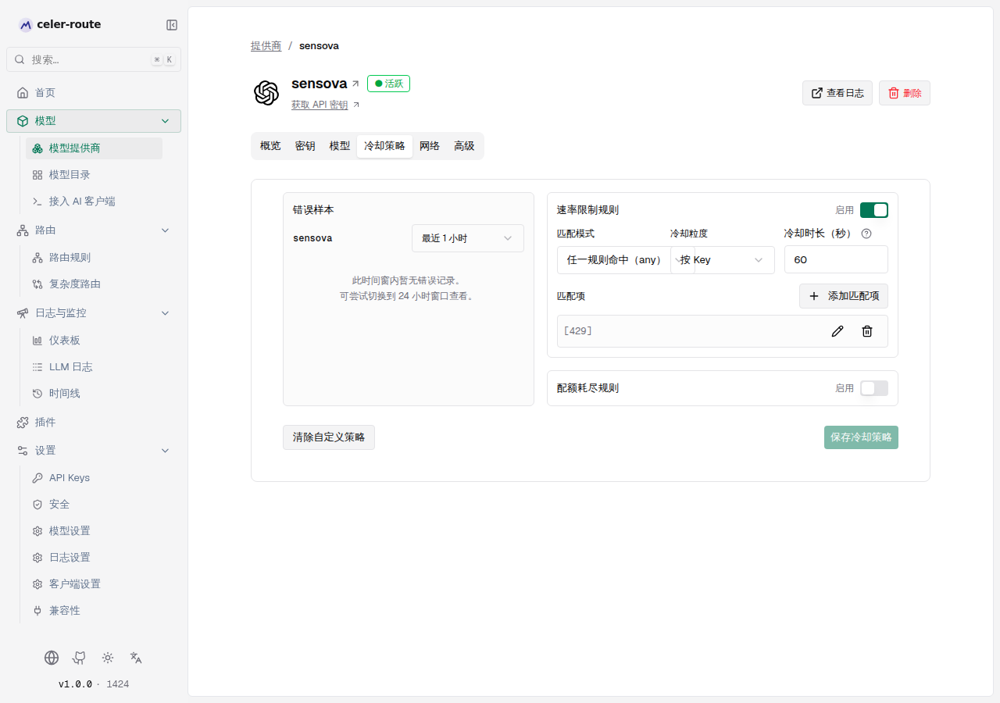
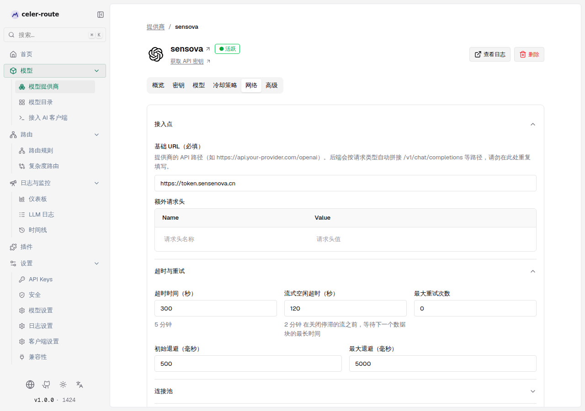
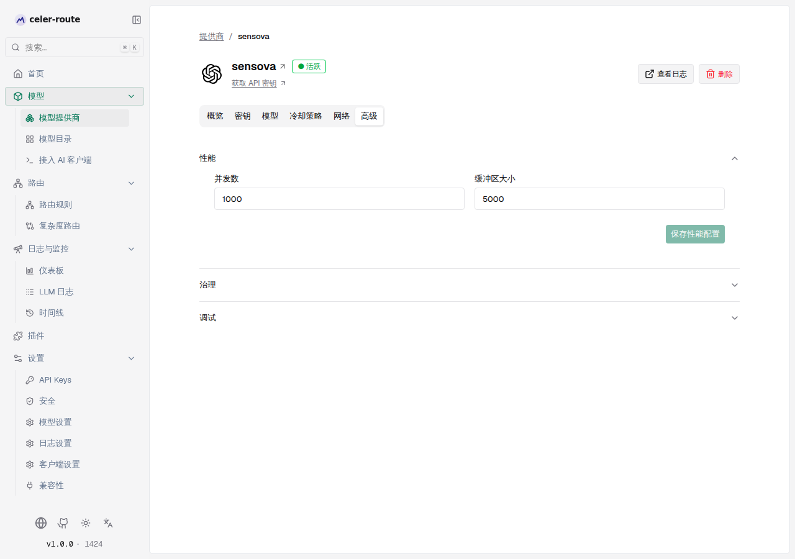

# 提供商详情页

在「模型提供商」列表里点击任一提供商的卡片，会进入 `/workspace/providers/$id`
详情页。这个页面把所有「围绕单个提供商的配置、监控与诊断能力」集中到一
个标签栏式界面：上方是提供商头部（名称、状态、外部链接、操作按钮），下方
是 **概览 / 密钥 / 模型 / 冷却策略 / 网络 / 高级** 六个标签页。下文按用户
的操作路径，逐一说明每个区域能做什么、看到什么、什么时候需要点进去。

## 页面头部

每张详情页顶部都固定显示以下信息（来自 `ui/app/workspace/providers/$id/page.tsx`）：

- **面包屑**：`提供商 / 提供商名称`，点击「提供商」回到列表页
- **图标 + 名称 + 状态徽章**：当提供商已配置至少一个密钥、且 `provider_status === "active"` 时，会在名称旁显示绿色 `● 活跃` 徽章
- **获取 API 密钥**：仅当该提供商需要密钥且有官方密钥申请链接时出现（来自 `ProviderApiKeyUrls` 常量）
- **查看日志**：跳转到「LLM 日志」并预选该提供商作为筛选条件
- **删除**：删除该提供商及其关联配置（需要 RBAC `ModelProvider:Delete` 权限）

密钥信息不需要打开"密钥"标签页就能看到——头部状态徽章会自动反映密钥是否健康。

## 概览（Overview）

概览标签页由「智能建议」+ 「四张只读卡片」组成，目的是让你 **在不离开概览页
的前提下，注意到可能需要修的配置问题**，再决定要不要跳到对应标签页去改。

### 配置建议（自动提示）

页面顶部会根据当前配置自动弹出**轻量建议**，逻辑来自
`ui/app/workspace/providers/$id/views/ConfigSuggestions.tsx`，触发条件
全部基于真实字段：

| 触发场景 | 标题 | 提示含义 |
|---|---|---|
| 已配置超过 1 个 API Key 但 `max_retries = 0` | 多密钥场景建议开启重试 | 单 Key 失败时不会自动切到其他 Key |
| 已配置超过 1 个 API Key 且未启用 Rate Limit 冷却策略 | 多密钥场景建议启用冷却 | 失败的 Key 不会被自动隔离 |
| `models_count = 0` | 尚未配置模型 | 该提供商没有可用模型，需前往「模型」标签页添加或同步 |
| Anthropic 系列（`anthropic` / `vertex` / `bedrock` / `bedrock_mantle` / `azure`）且未自定义 Beta 头部 | 自定义 Beta 头部 | 提示可在「高级 → Beta 头部」按需调整 |
| 使用了自定义 `base_url` 且请求超时为默认 300 秒 | 建议复核默认超时 | 自托管 / 反代场景延迟可能差异较大 |

这些建议只是提示，不会自动改你的配置。点击对应卡片右上角的「管理」即可跳
到具体的标签页。

### 四张只读卡片

| 卡片 | 显示内容 | 跳转到 |
|---|---|---|
| 密钥 | 当前 API 密钥数量 | 「密钥」标签页 |
| 模型 | 当前可用模型数量 | 「模型」标签页 |
| 冷却策略 | 「使用内置默认冷却策略…」或已覆盖后展示 `rate_limit` / `quota` 的 TTL | 「冷却策略」标签页 |
| 重试策略 | `max_retries` 与退避（初始/最大） | 「网络」标签页 |

只读卡片的目的是 **让你用一张截图就能向团队/审计说明当前配置概况**，不
需要展开 6 个标签页才能确认状态。

## 密钥（Keys）

密钥标签页是提供商管理的核心：增删 API Key、调整权重、启停、批量测试与同步模型。

工具栏提供以下操作：

- **搜索密钥**：按 Key 名称过滤
- **健康度筛选**：「全部 / 活跃 / 错误」三档切换（健康 = `enabled !== false` 且 `status === "success" 或未设`）
- **测试全部**：逐个调用 `POST /refresh-models`，按 Key 反馈通过/失败
- **同步模型**：对该提供商下所有 Key 触发一次模型刷新
- **添加密钥**：打开右侧抽屉，配置新 Key（认证方式、权重、允许/阻止的模型、部署覆盖等）

表格中每一行可执行：

- **多选 + 批量启用 / 禁用 / 重新测试 / 删除**：勾选行后顶部出现批量操作条
- **已启用 开关**：单独启停某个 Key
- **测试**：对该 Key 调用 `refresh-models` 接口，根据返回的 `status` 提示「密钥测试通过」或「密钥测试失败」
- **编辑 / 删除**：行尾的铅笔/垃圾桶图标；删除前会弹出确认对话框

对于 **免密钥（`is_key_less = true`）** 的提供商（如 `ollama`、`vllm`、`sgl`、`opencode`），标签页会
显示静态提示「此提供商无需 API 密钥，密钥管理不适用。」，不显示表格。

### 状态徽章含义

| 状态 | 颜色 | 含义 |
|---|---|---|
| 活跃 | 绿色 | Key 已启用且最近一次 `list_models` 成功 |
| 列出模型失败 | 红色下划线 | 该 Key 的 `list_models` 返回错误（鼠标悬停查看错误说明） |
| 错误 | 红色 | 其他错误（如 401/403 等） |

## 模型（Models）

模型标签页管理「这个提供商下，哪些模型 ID 可被路由」。

工具栏提供：

- **搜索模型**：服务端 substring 过滤（输入即查，300ms 防抖）
- **状态筛选**：「全部 / 活跃 / 已弃用」
- **测试全部**：对当前过滤后未弃用的模型逐个调用 `test-models` 接口，顶部进度条显示 `done / total`
- **同步**：对该提供商触发模型刷新（与密钥标签页的「同步模型」行为一致）
- **添加模型**：打开右侧抽屉「添加自定义模型」，可注册一个未被 Key 自动发现的模型 ID（如私有部署的自定义模型名），并指定其 `mode`（聊天补全 / 文本补全 / 嵌入 / 图片 / 音频）

表格中每一行可执行：

- **复制**：模型名右侧的复制按钮会复制「提供商/模型」限定 ID（格式如 `openai/gpt-4o`），用于客户端 `model` 字段
- **测试**：单模型测试，状态会就地显示 `XXms`（成功）或 `失败`（鼠标悬停看错误）
- **编辑属性**：打开「属性编辑抽屉」，可调整定价、限速、context window 等 catalog 属性

页面底部信息条显示「共 8 个模型中的 8 个」之类计数 + 搜索时附加「匹配 "query"」。

## 冷却策略（Cooldown Policy）

冷却策略标签页承载 **按提供商** 的限流 / 配额隔离规则。每个 Key 独立
进入冷却状态，冷却期内不会被路由命中。

页面由「错误样本」和「规则配置」两块组成：

### 错误样本（参考用）

左侧「错误样本」卡片按 **最近 1 小时 / 最近 24 小时** 两个窗口拉取该提供
商的历史错误（来自日志查询），可点击「应用」直接把样本转化为一条新的
匹配项，省去手填 HTTP 状态码或错误类型。

如果时间窗内没有错误，显示「此时间窗内暂无错误记录。可尝试切换到 24 小时窗口查看。」

### 规则配置（速率限制 / 配额耗尽）

可同时启用两类规则：

| 规则 | 含义 | 关键参数 |
|---|---|---|
| 速率限制规则（rate_limit） | 请求被上游拒后触发冷却（典型：429） | 启用、匹配模式（`any` / `all`）、冷却粒度（按 Key / 按 Key 按模型）、冷却时长（秒）、匹配项 |
| 配额耗尽规则（quota） | 账户级配额用尽后触发冷却（典型：额度到期） | 同上 |

每条「匹配项」可按 HTTP 状态码、错误消息包含字符串、错误类型、错误代码
四类条件组合，匹配模式决定是「任一规则命中」还是「所有规则都命中」才触发冷却。

如果两个开关都关闭，页面底部会出现「清除自定义策略」按钮，点击后恢复
使用 **内置默认冷却策略**（OpenAI 默认限流 60s / 配额 600s，定义于
`core/schemas/provider.go` 的 `DefaultCooldownPolicy`）。

> 如果是首次接触冷却策略，建议直接看《提供商冷却策略》一文（在「功能」分类下）——本标签页只是其 UI 入口。

## 网络（Network）

网络标签页集中处理 **接入点、超时、重试、连接池、代理 / TLS** 这类底层
网络参数。表单由四个折叠分组构成（默认展开「接入点」与「超时与重试」）：

### 接入点

- **基础 URL**（自定义提供商为「必填」，内置提供商为「可选」）：填到路径
  前缀即可（如 `https://api.your-provider.com/openai`），后端会按请求类
  型自动拼接 `/v1/chat/completions` 等路径
- **额外请求头**：以键值对形式追加到所有发往该提供商的上游请求；常用于
  灰度标识、内部代理所需 header 等

### 超时与重试

- **超时时间（秒）**：整个请求的超时上限。下方会用人类可读格式展示（如
  `5 分钟`）
- **流式空闲超时（秒）**：关闭停滞流前等待下一数据块的最长时间。注意
  流式响应不受「超时时间」整体限制
- **最大重试次数**：失败后自动重试的最大次数
- **初始退避（毫秒）** / **最大退避（毫秒）**：重试之间的指数退避区间

### 连接池

- **每个主机的最大连接数**：fasthttp 客户端对单上游主机的连接池上限。HTTP/2
  提供商（如 Bedrock）每连接约 100 个并发流，超过该值需调高
- **保持活动超时（秒）**：池化连接的空闲保活时间，建议略低于上游的保活时间
- **强制 HTTP/2**：仅对基于 `net/http` 的提供商（如 Bedrock）有意义

### 代理与安全

- **代理类型**：「无 / HTTP / SOCKS5 / 环境变量」。启用后会出现 URL、用户名、密码、CA 证书（PEM）字段
- 代理 URL 同样支持 `env.MY_VAR` 语法注入
- **TLS / 证书**：跳过 TLS 验证（最后手段）、自定义 CA 证书（PEM，支持 `env.X` 注入）

修改后页面下方会出现「保存网络配置」按钮。`base_url` 字段被清空时会校验
当前是否已留空，避免把网络配置整个移除。

## 高级（Advanced）

高级标签页是 **按需开启的折叠面板**，内容会因提供商类型不同而变化（控制
逻辑见 `ui/app/workspace/providers/$id/views/AdvancedTab.tsx`）：

| 折叠区 | 是否默认展示 | 说明 |
|---|---|---|
| 性能 | 始终展示 | 配置提供商的并发数与缓冲区大小（影响该提供商的内部 worker 池） |
| 治理 | 始终展示（需要 `Governance:View` 权限） | 配置该提供商级别的预算上限与速率限制（与「治理」全局页面联动） |
| Beta 头部 | 仅 Anthropic 系列（`anthropic` / `vertex` / `bedrock` / `bedrock_mantle` / `azure`）展示 | 配置 Anthropic Beta header 的覆盖，支持内置开关 + 自定义前缀 |
| OpenAI 配置 | 仅 `openai` 提供商展示 | 切换 Responses API 的 `store` 默认值（关闭 store 可避免响应 ID 变成持久服务端对象） |
| 调试 | 始终展示 | 「返回原始请求 / 返回原始响应 / 存储原始请求-响应」三个开关，逐请求 header 覆盖 |

### Beta 头部（Anthropic 系列特有）

每个 Beta 能力都有三档状态：

- **支持**：将对应 Beta header 追加到请求
- **不支持**：明确从请求中移除该 header
- **默认**：跟随 Anthropic 的内置默认（不发送也不显式阻止）

另可添加自定义 Beta 头部前缀（如 `new-feature-`）。前缀只能包含小写字
母、数字和连字符，且不能与内置项冲突。

### 调试（所有提供商通用）

调试开关会同时影响「该提供商下所有请求」与「按请求 header 覆盖」，作用
于请求生命周期的不同时点：

| 开关 | 请求头覆盖 | 含义 |
|---|---|---|
| 返回原始请求 | `x-bf-send-back-raw-request: true/false` | 在 API 响应中附带回原始 provider 请求体 |
| 返回原始响应 | `x-bf-send-back-raw-response: true/false` | 在 API 响应中附带回原始 provider 响应体 |
| 存储原始请求-响应 | `x-bf-store-raw-request-response: true/false` | 在日志记录中持久化原始请求/响应负载 |

三者独立开关，适合用于「线上默认不开、按请求临时打开排查」的工作流。

## 默认行为：开箱即用

| 场景 | 默认 |
|---|---|
| 没有任何 API Key | 状态徽章不显示；密钥标签页显示「未找到密钥」空态；模型标签页显示「未找到该提供商的模型」 |
| 启用了多个 Key 但 `max_retries = 0` | 概览顶部出现「多密钥场景建议开启重试」警告，但不会自动改 |
| 没有自定义冷却策略 | 冷却策略标签页显示「使用内置默认冷却策略」；OpenAI 默认 rate_limit=60s / quota=600s |
| 自定义提供商未填 base_url | 网络标签页保存按钮被禁用，并提示「自定义提供商必须填写基础 URL」 |
| `is_key_less = true` 的提供商（Ollama / vLLM / SGLang / OpenCode） | 密钥标签页直接显示「此提供商无需 API 密钥」 |

## 常见场景速查

| 想做的事 | 在哪里点 |
|---|---|
| 新增一个 API Key | 密钥标签页 → 添加密钥 |
| 同时给多个 Key 做健康检查 | 密钥标签页 → 测试全部 |
| 把已弃用模型从路由里剔除 | 模型标签页 → 状态筛选「已弃用」→ 编辑属性 |
| 上游频繁返回 429 想让网关自动切 Key | 冷却策略标签页 → 启用「速率限制规则」→ 加一条 `HTTP 状态码 = 429` 匹配项 |
| 自托管服务的延迟比官方大很多 | 网络标签页 → 「超时与重试」分组 → 调高「超时时间」「流式空闲超时」 |
| 反向代理后端需要固定 header | 网络标签页 → 「接入点」分组 → 额外请求头 |
| 通过灰度环境区分流量 | 网络标签页 → 「代理与安全」分组 → 类型选「HTTP」+ 填代理 URL |
| 临时排查单个请求 | 高级标签页 → 「调试」分组 → 启用「返回原始请求/响应」 |
| 客户报某 Key 失败但其他正常 | 密钥标签页 → 健康度筛选「错误」→ 单独测试或禁用该 Key |
| 跳到该提供商的请求日志 | 页面头部「查看日志」按钮 |

## 相关文档

- [支持的提供商](./supported-providers) — 列出全部 40+ 内置提供商
- 《提供商冷却策略》（位于「功能」分类） — 冷却规则的完整背景与最佳实践
