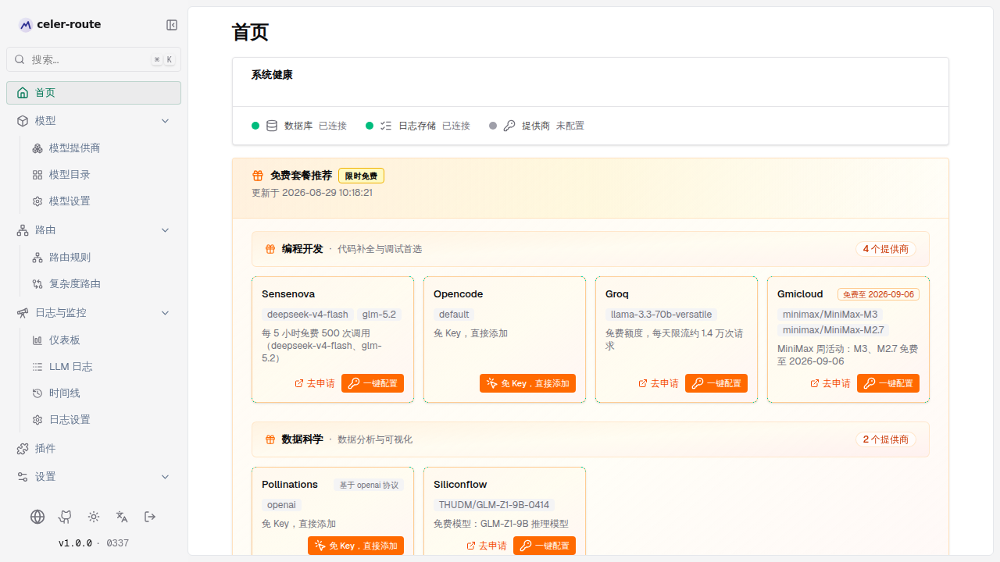

# 免费套餐推荐

首页顶部「免费套餐推荐」卡片把当下仍有免费额度的 LLM / 多模态提供商按使用场景
分组展示，点卡片即可**一键接入**，不需要去各家控制台翻注册文档。

这张卡片的来源是运营维护的免费提供商目录（GitHub 上托管的两份 JSON），网关每次启动或
周期刷新时下载最新快照，首页按当前界面语言渲染。你无需在本地做配置——只要网关能
连到外部目录源，目录更新后会自然出现在你首页上。

## 在首页看到什么

卡片按 **bundle（场景分组）** 展示，常见的稳定分组有「编程开发」「数据科学」
「图像生成」等。每个 bundle 下是一组**提供商卡片**，每个卡片承载以下信息：

| 字段 | 用户视角的含义 |
|------|----------------|
| 提供商名 | 该条目的供应商，命中你已有的同名提供商时显示「已配置」并直接跳到详情页 |
| 模型标签 | 该条目推荐的免费模型清单，便于一眼判断是不是你需要的 |
| 有效期 | 限时免费活动会标注「免费至 yyyy-mm-dd」；常驻免费则不显示 |
| 协议徽标 | 非内建条目会显示「基于 openai / anthropic … 协议」（作为自定义提供商） |
| 说明 | 额度、限流、申请提示的简要描述 |

卡片右上角带「**限时免费**」徽标，下方标注「更新于 yyyy-MM-dd HH:mm:ss」。



每个 bundle 标题右侧会显示该组下的提供商数量（`{{count}} 个提供商`），整体网格
在桌面端按 1/2/3/4 列自适应。

## 提供商卡片的三种状态

点进具体一张卡片，会因为条目和你当前实例的关系呈现不同的状态：

- **未配置**：卡片是橙色调，显示「**去申请**」外链（跳到该提供商的注册页）和「**一键配置**」按钮。
- **已配置**：卡片变成到提供商详情页的链接，并显示「**已配置**」徽标与健康指示点；点击直接查看该提供商的当前状态。
- **不支持**：当前网关版本无法接入该提供商（不在内建列表，也没有合法的兼容协议兜底）时，卡片会置灰、只保留申请链接，移走一键配置入口并标注「**当前版本暂不支持**」。

免 Key 条目（如 OpenCode Free）的按钮文案会变成「**免 Key，直接添加**」，点击无需
粘贴 API 密钥即可直接添加。

## 怎么用：一键接入

对未配置的免费条目：

1. 在首页找到目标提供商卡片，点击「**一键配置**」（或免 Key 条目的「**免 Key，直接添加**」）。
2. 在弹出的配置对话框里确认：
   - **去申请**：跳到该提供商的注册页（带外部图标指示新标签打开），按目录中的「申请步骤」完成注册、拿到 API Key；
   - **API 密钥**：把申请到的 Key 粘到输入框；免 Key 条目这步直接省略；
   - **模型**：对话框会显示该条目推荐的模型列表，可作为参考。
3. 点击「**添加提供商**」提交，完成后右上角会弹出「提供商配置成功」toast。

提交后，卡片会从橙色「一键配置」变成蓝色「**已配置**」，并直接指向该提供商的详情页，
方便你立刻查看 key 状态、健康度。

## 没有看到推荐怎么办

首页若只显示空状态卡，写着「**暂无可用免费套餐，请稍后重试。**」并带「**重试**」
按钮——表示当前没有可用的 bundle 列表（目录拉取失败、上游目录为空、或网关关闭了
远程目录模块）。

常见的两种情况：

- **网络或上游目录暂时不可达**：过几分钟点「重试」，或在浏览器开发者工具查看网络请求
  是否能拿到 `/api/catalog/bundles` 的 200 响应；
- **网关关闭了远程目录模块**：网关配置文件里该模块被关闭，按你部署环境向网关管理员反馈。

## 维护免费目录（给运营 / 仓库维护者）

> 这一节是面向仓库维护者与目录运营的，普通用户不需要读到这里。

免费目录的来源是仓库里的两份 JSON（中 / 英各一份，结构字段必须完全一致）：

```
website/static/recommended-providers/
├── zh-CN.json
└── en.json
```

该目录托管在项目 GitHub Pages 上，是运行时网关的唯一真相源——目录更新后，所有运行中的
网关（只要没关掉远程目录模块）下次刷新就会拿到新条目。

### bundle 分类约定

bundle 的 `id` 是稳定 slug，首页、i18n、UI 测试、GitHub Pages URL 都锚定这些 id，
**不允许改名 / 合并 / 拆分**。当前稳定分组：

| `id` | 中文标题 | 英文标题 | 用户场景 |
|------|---------|---------|---------|
| `coding` | 编程开发 | Coding & Development | 代码补全、bug 定位、Code Review、写脚本 |
| `data-science` | 数据科学 | Data Science | 数据分析、NL→SQL/Pandas、报表、图表 |
| `image-generation` | 图像生成 | Image Generation | 文生图、配图、icon、海报、头像 |
| `speech`（按需启用） | 语音 / TTS STT | Speech | 配音、会议纪要、字幕、有声书 |
| `video`（按需启用） | 视频生成 | Video Generation | 宣传片、产品演示、文生视频 |

分类反映**用户场景**（"用户在哪类场景下点开这个目录"），不是供应商能力或价格
梯度。同一供应商按主用场景放在一个 bundle，**不跨 bundle 重复**。

新增 bundle 的触发条件是该场景内已有 **≥ 2 个真实可用的免费供应商**；删除 bundle
的触发条件是该场景所有供应商全部停服，不保留空壳。

### 单条目字段规则

- 非内建条目必须填自定义提供商的兜底协议与 base URL，否则服务器会标注
  `supported=false`，一键配置入口会消失；
- `provider` 键保持稳定——改名会让已缓存该行的客户端错位；
- 不要随意翻转「免 Key」状态（它决定对话框是否出现 API Key 输入框）；
- 双语文件结构必须一致：每个 `bundle.id` 与每个 `provider` 在 `zh-CN.json` 与
  `en.json` 中都存在且构成一致（运行时按请求语言选一个文件）。

### 校验

编辑后跑校验脚本，确保无效条目不会被运行中的网关接收：

```bash
python3 .opencode/skills/refresh-free-tier-catalog/scripts/validate_catalog.py
```

脚本镜像 Go 端目录接收端的所有规则：白名单协议、http(s) URL、bundle / provider
不重复、双语 parity。输出必须是 `OK:` 才允许推送，否则运行中的网关会拒收目录。