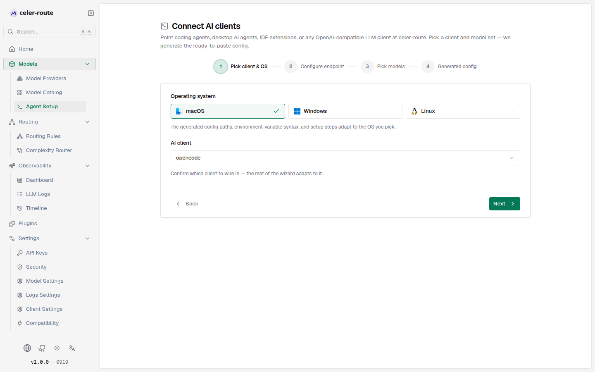

# Connect AI clients

Once celer-route is installed and configured, the next step is pointing the LLM clients you actually use — coding agents, desktop agents, IDE extensions, or any OpenAI-compatible tool — at the gateway, so you no longer juggle separate API keys for each tool or hop between vendor consoles.

The **Connect AI clients** page in the Web UI does exactly this. It pulls `/v1/models` live from the gateway and emits ready-to-paste config for the client you picked. The flow is a four-step wizard — Pick client & OS → Configure endpoint → Pick models → Generated config — no hand-written JSON or TOML, no need to memorize where each tool keeps its config file.

## Open the page

- Finish the [quick start](../intro) (celer-route is up and you can call `chat/completions` once)
- Left sidebar → **Models → Agent Setup**
- Or click the **Connect AI clients** card shown after the onboarding tour

## Flow at a glance

The page is a four-step wizard with a progress indicator on top and **Back / Next** buttons on the bottom. You don't need to wait between steps — click **Next** to advance, or click a step on the progress bar to jump back and revise. The generated config area updates live as you change anything.

| Step | What you do | What it decides |
|---|---|---|
| Pick client & OS | Pick an AI client and the operating system | The config format emitted, and the path syntax used |
| Configure endpoint | Fill in the Base URL and (if needed) the API key | Where the client connects and which key authenticates |
| Pick models | Check the models to expose and pick the default | Which models show up in the client and which one is the startup default |
| Generated config | Copy the file content, run the apply command, or curl-test the endpoint | How the config actually lands on your machine |

## Step 1 — Pick client & OS

**Operating system** drives the generated config paths and environment-variable syntax: macOS / Linux use `~/…` and bash / zsh `export`; Windows uses `%USERPROFILE%\…` and shows PowerShell and cmd forms side by side. The OS is auto-selected from your UA but you can switch it manually — the choice is written to a URL query parameter (`?platform=windows`) and persists across reloads and shared links.

**AI client** lists every built-in wiring in four groups: Coding agents, Domestic desktop agents, IDE & extensions, Generic OpenAI-compatible. Each client maps to one config format and one target file. Whether the "Models to expose" multi-select shows up in the next step also depends on this pick — clients that embed a model list in their config file show the multi-select; clients that only carry a single default-model reference don't.

## Step 2 — Configure endpoint

- **Base URL**: Defaults to the origin you're currently accessing (for example `http://localhost:8080`). Change it to point at a remote gateway — the engine appends `/v1` or `/anthropic` per client, so **don't** add a trailing path yourself.
- **API Key**:
  - If inference auth is on (`enforce_auth_on_inference`), the dropdown only shows virtual keys that already exist under **Governance → API Keys**. If none exist, the page tells you to go create one.
  - If inference auth is off, the page shows "Inference auth is disabled" and the generated config omits the API key field.
- **Use Responses API (@ai-sdk/openai) instead of Chat API** — opencode only: checking it makes opencode hit `/v1/responses` instead of `/v1/chat/completions`. Only tick it if you've confirmed every link in the chain fully supports the Responses API.

## Step 3 — Pick models

Model candidates are fetched live from `/v1/models`, scoped by the API key you picked in the previous step — once you change the key, both the list and the default-model dropdown refresh against the key's visible scope.

- Some clients show a **Models to expose** multi-select (with a search box, **Select all / Clear** toggle, and **Refresh** button). Everything is selected by default; deselect to trim the surface you expose to that client.
- Every client shows a **Default model** dropdown — pick which model the client uses on startup. For WorkBuddy / CodeBuddy the chosen default is placed first in the list.
- You must pick at least one default model — otherwise the next step's **Generated config** shows "Select at least one model to generate a config."

When you add or retire a model on the gateway, come back here, click **Refresh**, regenerate, and re-paste into the client.

## Step 4 — Generated config

The **Generated config** area is organized into tabs, in this order:

1. **Apply with one command** — a self-contained shell command (bash on macOS / Linux, PowerShell on Windows). Paste it into a terminal and it writes the config into place: backs up the existing file, then surgically merges — only keys relevant to celer-route are overwritten, every other provider and setting is preserved. If the existing config is corrupt, the command aborts instead of clobbering it. Most clients need a restart after this runs.
2. **Config file** — the final file contents (`opencode.json`, `settings.json`, `config.toml`, `models.json`, …). Use this when you want to copy manually or feed it into a script.
3. **Environment** — `export` the variables before launching the client and it talks to celer-route with no config-file changes. Useful for quick tests, CI, and remote dev boxes.
4. **Test with curl** — a one-shot request against the Base URL + API key + default model you just chose. A 200 response means the path and default model both work end-to-end; any 4xx / 5xx surfaces verbatim for debugging.

Tabs that don't apply to a client aren't shown — for example, **Apply with one command** and the **Config file** tabs are skipped for Cursor / Trae / ZCode / Tongyi Lingma, which can only be configured in-app.

Changing anything earlier in the wizard re-renders this area immediately; the tabs always reflect the latest selections.

## Notes

- **No auto-discovery** — after you add or retire a model, come back here, refresh, regenerate, and re-paste into the client
- **Model IDs are `provider/model`** — clients need the full ID from `/v1/models` (for example `openai/gpt-4o`), not the display name — using the display name is the most common cause of "model not found"
- **API key is shown in cleartext** — once you pick a key the page shows its `value` only on this page so you can copy it; don't screenshot and share
- **Responses API** — opencode's checkbox routes through `/v1/responses`; a few upstream providers may not fully support it yet — uncheck if you hit a compatibility issue
- **Path conventions** — Trae and friends require the Base URL to include the full `/v1`; Claude Code's `ANTHROPIC_BASE_URL` must end at `/anthropic` and **not** include `/v1` — the wizard already follows each client's convention

## Headless scenarios

You don't need the UI to inspect the catalog — `celer-route-setup models` works offline against the gateway state and is fine for CI, remote boxes, and scripted workflows.