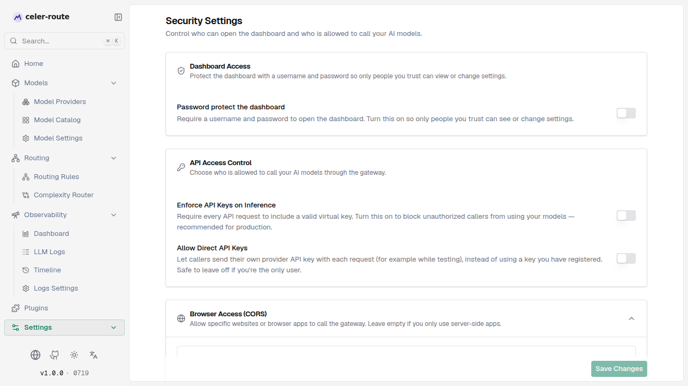
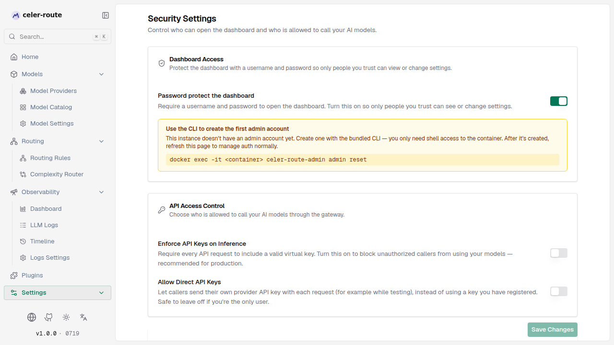

# Dashboard password protection

By default, the celer-route admin dashboard (`http://<host>:8080`) is open to
anyone who can reach it. Once **dashboard password protection** is enabled,
opening the dashboard redirects you to a login page, and every `/api/*`
management endpoint requires HTTP Basic auth — only holders of the admin
credentials can view or modify settings.

## How it works

| Aspect | Description |
|--------|-------------|
| **Login page** | Once enabled, visiting any workspace page redirects to the login page; enter username and password to enter |
| **Credential storage** | Username and password are stored in the config store (SQLite or Postgres); the password is hashed with Argon2id — cleartext is never written to disk |
| **Password policy** | At least 12 characters, including uppercase, lowercase, digits, and special characters — the Web UI and CLI share the same policy |
| **Two paths** | The first admin must be created via the CLI (or `setup_token`); after that, day-to-day password changes and auth toggling happen in the Web UI |

## First-time setup (CLI)

A brand-new celer-route instance has no admin account, so you cannot set the
password from the Web UI directly — the endpoint that creates the first admin
is itself unprotected. With the Docker deployment, the recommended approach is
to write the admin record via the built-in CLI, no `setup_token` required.

Open **Settings → Security → Dashboard Access** and turn on the **Dashboard
password protection** toggle. If there is no admin yet, the page will prompt
you to create one via the CLI:



Run on the host as instructed:

```bash
# 1. Start the container (config_store section must exist)
docker compose up -d

# 2. Exec into the container and run the CLI
docker exec -it celer-route \
  celer-route-admin admin reset
```

The CLI prints the current state first (no admin → will CREATE; admin exists →
will RESET password), then prompts for the username and password after
confirmation. Output on completion:

```
Done.
  Admin username: admin
  Auth enabled:   true
  Next step:      log in to the celer-route dashboard.
  Note:           BIFROST_SETUP_TOKEN / setup_token is no longer required for this node.
```

Refresh the **Security** page in your browser and you will see the username /
password management form. From this point on, opening `http://localhost:8080`
in a browser will redirect to the login page (you can verify this by opening
an incognito window and visiting any workspace URL).

### Script / CI usage

In CI pipelines, drive the CLI non-interactively with three flags. When stdin
is not a TTY, `--password-stdin` is required to keep the password from leaking
into process listings or CI logs:

```bash
docker exec -i celer-route \
  celer-route-admin admin reset \
  --username admin \
  --password-stdin \
  --yes \
  <<< $'NewPassword123!\nNewPassword123!\n'
```

- `--username` — skip the username prompt
- `--password-stdin` — read two lines (password, confirm password) from stdin;
  required when not a TTY
- `--yes` — skip the `[y/N]` confirmation

## Day-to-day management (Web UI)

Once the admin is created, all routine operations happen on
**Settings → Security → Dashboard Access** — no more CLI needed:



- **Toggle dashboard password protection** — top switch; disabling it removes
  authentication from both the dashboard and `/api/*`
- **Change username / password** — edit directly in the username / password
  fields, then click **Save changes**. The password field validates the policy
  inline (12+ characters, mixed case, digit, special char)
- **Log out** — the **Log out** button at the bottom of the sidebar

:::note
The CLI-created admin sets `is_enabled = true`, so dashboard auth is on the
moment the CLI succeeds. To temporarily disable it, toggle the switch off in
the Web UI.
:::

## CLI reference

```
celer-route-admin admin reset [flags]

Flags:
  --config PATH        Path to the celer-route config.json. If omitted, the
                       default SQLite database under <app-dir>/config.db is used
  --app-dir PATH       Application data directory (default: $APP_DIR env var,
                       or current directory); only used when --config is not
                       provided
  --username NAME      Skip the username prompt and use NAME
  --password-stdin     Read the password (and confirmation) from stdin instead
                       of the terminal
  --yes                Skip the interactive confirmation prompt
```

Inside a Docker container, no flags are usually needed — the CLI defaults to
the container's `config.db`. `celer-route-admin admin reset` is enough.

## Security notes

- The CLI **does not open** any network listener. It only reads/writes the
  config store declared in `config.json` (SQLite file or Postgres DSN).
- The shell privilege required to run the CLI is the same as `cat config.json`
  — anyone who can read the latter can already read the existing admin hash,
  so the CLI adds no new attack surface.
- Multi-node deployments: when sharing a Postgres backend, run it only once on
  any one node (the record is the single source of truth); with per-node
  SQLite, run it once on each node against that node's local `config.db`.

## Common scenarios

- **Forgot the password** → reset it with
  `celer-route-admin admin reset` (RESETs the existing admin password; the
  username can stay unchanged)
- **Want to temporarily disable login** → toggle the **Dashboard password
  protection** switch off on the Web UI Security page
- **CI auto-init** → combine `--username` + `--password-stdin` + `--yes` and
  pipe the password in via stdin, never the command line
- **First toggle and you see the CLI prompt** → expected; there is no admin
  yet, follow the prompt to create one via CLI and refresh the page
