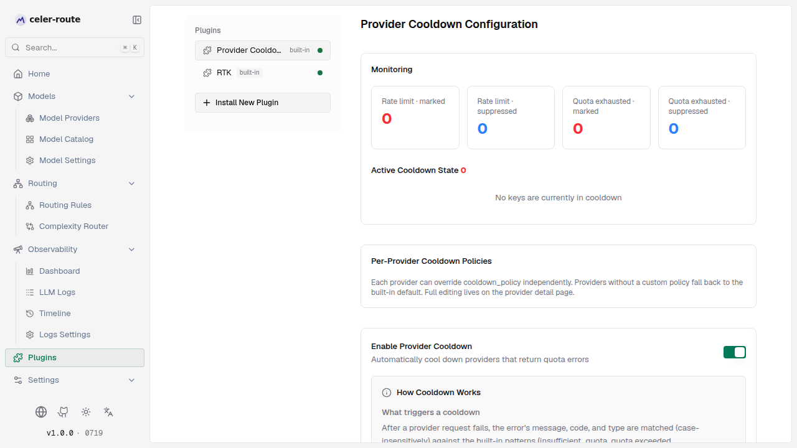
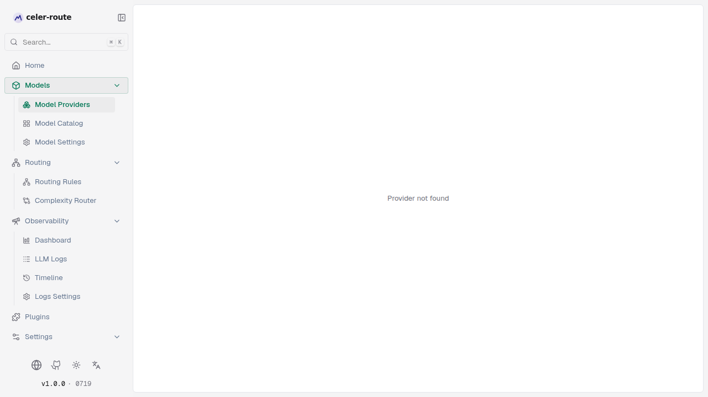

# Provider cooldown

**Provider Cooldown** is a built-in automatic-protection feature in
celer-route: when a provider key returns a quota-exhausted or rate-limited
error, the plugin **temporarily removes it from the key pool** so subsequent
requests automatically route to other healthy keys instead of repeatedly
hitting the same wall. When the cooldown expires, the key is restored
automatically.

You don't need to touch any config files — everything can be done from the
Web UI:

- **Monitor**: see which keys are cooling, why, and when they recover
- **Unfreeze**: if a key has recovered earlier than expected, manually unfreeze
  it with one click
- **Configure rules per provider**: decide which errors trigger cooldown, how
  long the cooldown lasts, and whether to scope by key or by model

## How it works

| Aspect | Description |
|--------|-------------|
| **What triggers cooldown** | After a failed request, the plugin matches the error's **message, code, and type** case-insensitively (built-in patterns: `insufficient_quota`, `quota exceeded`, `quota_exceeded`, `billing`, `usage limit`), gated by status code: HTTP 429 and other 4xx trigger when text matches; **HTTP 402 and 5xx never trigger**. |
| **Effect during cooldown** | The failing `(provider, key)` is skipped in key selection for the cooldown duration (default 300 s); requests fall through to other healthy keys under the same provider, then in order to other providers. If every available key is cooling, requests get a synthetic error `429 no_eligible_keys` with a `Retry-After` response header hinting the soonest time a retry could succeed. |
| **Recovery** | TTL expiry restores the key automatically — no manual intervention. Cooldown state lives **in process memory**; restarting celer-route clears every cooldown record. |

## Enable / disable cooldown

Open **left sidebar → Plugins** and select **Provider Cooldown**:

1. Find the **Enable provider cooldown** toggle and turn it on (it is on by
   default)
2. Turning it off disables cooldown globally

## Monitor cooldown state

The plugin page's **Monitoring** panel auto-refreshes every 5 seconds, with
two blocks:

**Stats cards** (four counters)
- **Rate limit · Marked / Suppressed**, **Quota exhausted · Marked / Suppressed**
- *Marked* = cumulative number of triggers; *Suppressed* = cumulative number
  of requests intercepted (skipped in key selection)

**Active cooldown entries**
- Lists each entry currently cooling: provider, key ID, reason for cooldown
  (rate limit / quota exhausted), **expiry time** (local timezone + relative
  countdown)
- Each entry has an **Unfreeze** button on the right — click it to send the
  key back to the pool immediately without waiting for the TTL (keyless
  providers do not show this button)

## Configure cooldown policy

Cooldown rules are **configured per provider**. Each provider either uses the
**built-in default policy** (works out of the box, no configuration needed) or
a custom one.

### Where to configure

- **Path 1**: plugin page → **Per-provider cooldown policies** list → click
  **Edit / Configure** for a provider
- **Path 2**: **left sidebar → Model Providers** → enter a provider's detail
  page → Overview → **Cooldown policy** → **Edit**

### Form layout

**Error samples (left column)** — so you don't have to guess what errors look like
- Time-window toggle **Last 1 hour / Last 24 hours**, listing real past errors
  for this provider
- Each error sample can be clicked **Apply** to add it to the *rate-limit rule*
  or *quota-exhausted rule*, which auto-generates the matching entries (status
  code / error type / error code / message fragment)

**Rule editor (right column)** — rate-limit rules + quota-exhausted rules; each
rule contains:

| Field | Description |
|-------|-------------|
| **Enable** | Toggle; if both toggles are off (or empty), saving reverts to the built-in default policy |
| **Match mode** | Any rule matches (any) / All rules match (all) |
| **Cooldown granularity** | **Per key** (default): one hit cools the whole `(provider, key)`. **Per model**: only cools `(provider, key, model)` — useful when providers rate-limit per model (e.g. per-model TPM/RPM), so one model maxing out doesn't drag down other models under the same key |
| **Cooldown duration (seconds)** | How many seconds (1–86400) the entry stays cooled, during which it won't be selected |
| **Match entries** | One or more match conditions: HTTP status code, message contains, error type, error code; click **+ Add match entry** to add, the pencil icon to edit, the trash icon to remove |

### Save & revert

- **Save cooldown policy**: applies your custom policy; afterward, the plugin
  page shows the provider's rule summary and live stats
- **Clear custom policy**: restore the built-in default with one click
- Rule editing is validated via Zod — invalid input is flagged inline and
  cannot be saved

## Built-in default policy

Any provider without a custom policy falls back to a built-in default tuned
for that provider's error semantics — for example, OpenAI rate limit cools
for 60 s and quota cools for 600 s; Anthropic / Gemini / Vertex rate-limit
cools for 60 s; the generic default is 300 s. **Out-of-the-box protection,
zero configuration.**

## Common scenarios

- **A key keeps reporting quota exhausted** → confirm in the plugin page
  monitoring panel that it is currently cooling, go to that provider's
  detail page and raise the quota rule's cooldown duration; set the
  granularity to **Per key**
- **One model under the same key drags the others down** → switch the
  granularity to **Per model**; one model's rate limit no longer affects the
  other models under the same key
- **Manual override** → if a cooled key has already recovered (e.g. you
  just topped up), click **Unfreeze** directly in the plugin page monitoring
  panel
