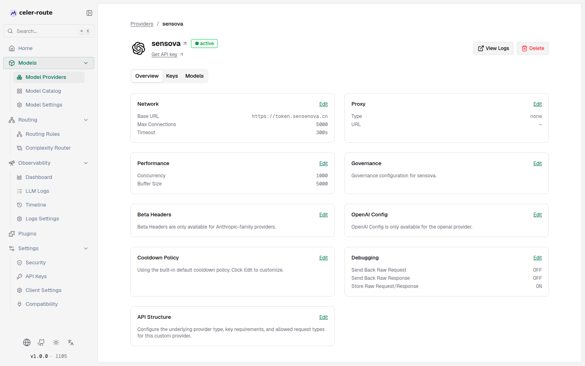
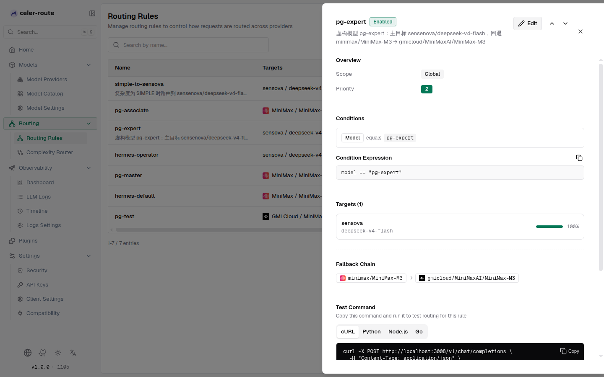
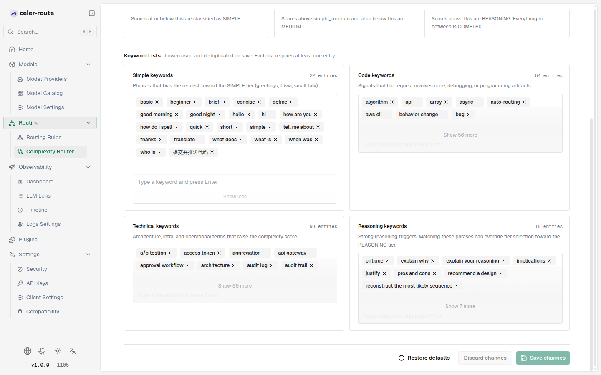
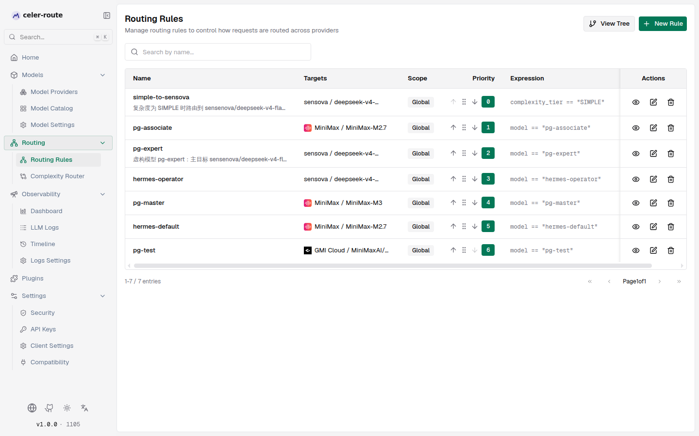

# Routing rules examples

This page walks through two complete scenarios that show how to configure
celer-route routing rules from scratch. Each scenario includes concrete steps
and field values that you can replicate in your own instance.

:::tip[Read first]
If you are not yet familiar with routing rule basics (scope, priority,
weighted targets, chain rules, fallback chains), read
[Routing rules](./routing.mdx) first.
:::

---

## Scenario 1: route a fictitious `pg-expert` model by condition

**Goal**: invent a model name `pg-expert`. When the request's `model` field
equals `pg-expert`, route it to sensova's `deepseek-v4-flash` model; if
sensova fails, fall back in order to minimax's `MiniMax-M3` and GMI Cloud's
`MiniMaxAI/MiniMax-M3`. Also configure the sensova provider with two API
keys, two retries on failure, and a 20-second cooldown for HTTP 429 errors.

### Step 1 — configure the sensova provider

Open **sidebar → Model Providers → sensova**, and configure the following
three areas on the overview page:

**1.1 Add two API keys**

1. Click the **Keys** tab
2. Click **Add key**, fill in the first key's name and API key value, then save
3. Click **Add key** again, fill in the second key, then save

The sensova provider now has two keys; load balancing rotates between them.
When one is cooling, the other stays healthy.

**1.2 Set the retry count to 2**

1. Back on the **Overview** tab, find the **Network** section and click **Edit**
2. In the network form, set **Max retries** to `2`
3. Save

sensova's requests now retry up to 2 times after failure before falling
through to the fallback chain.

**1.3 Set a 20-second cooldown for HTTP 429**

1. On the overview page, find the **Cooldown policy** section and click **Edit**
2. In the cooldown-policy editor:
   - **Rate limit rule**: turn the **Enable** switch on
   - **Cooldown granularity**: choose **Per Key** (each key cools down
     independently)
   - **Cooldown TTL (seconds)**: enter `20`
   - **Match entries**: click **Add match entry**, enter `429` in the
     **HTTP status code** field
3. Click **Save cooldown policy**

After this, when one of sensova's keys receives HTTP 429, that key cools
down for 20 seconds; during the cool-down, requests automatically rotate to
the other healthy key. If both keys are cooling, requests flow into the
fallback chain.

### Step 2 — create the `pg-expert` routing rule

Open **sidebar → Routing → Routing Rules**, click **New rule**, and fill out
the three-step wizard:

**Basics**

| Field | Value |
|-------|-------|
| Rule name | `pg-expert` |
| Description | Fictitious model pg-expert: primary target sensova/deepseek-v4-flash, fallback minimax/MiniMax-M3 → gmicloud/MiniMaxAI/MiniMax-M3 |
| Enable rule | On |
| Chain rule | Off |
| Scope | Global |
| Priority | `2` (or any unused value) |

**Match conditions**

Switch to **Match conditions**, and add a rule in the visual builder:

- **Field** = **Model**
- **Operator** = **equals**
- **Value** = `pg-expert`

The expression preview at the bottom shows: `model == "pg-expert"`

**Targets and fallbacks**

Switch to **Targets and fallbacks**:

Routing target (1):

| Provider | Model | Weight |
|----------|-------|--------|
| sensova | deepseek-v4-flash | 1 |

Fallbacks (2, in order):

| Order | Provider | Model |
|-------|----------|-------|
| 1st fallback | minimax | MiniMax-M3 |
| 2nd fallback | gmicloud | MiniMaxAI/MiniMax-M3 |

Click **Save rule**.

### Verify

After saving, click `pg-expert`'s **view** button in the rule list to confirm
the full configuration:

The detail panel shows:
- **Condition**: `model == "pg-expert"`
- **Target**: sensova / deepseek-v4-flash, weight 100%
- **Fallback chain**: `minimax/MiniMax-M3` → `gmicloud/MiniMaxAI/MiniMax-M3`
- **Test command**: an auto-generated cURL command using `model: "pg-expert"`
  that you can run to verify the routing

When a client sends a request with `model: "pg-expert"`, celer-route:
1. Matches this rule
2. Routes the request to sensova's `deepseek-v4-flash` (load balanced
   across the two keys, with up to 2 retries)
3. If sensova still fails, falls back in order to
   `minimax/MiniMax-M3` → `gmicloud/MiniMaxAI/MiniMax-M3`

---

## Scenario 2: route by complexity

**Goal**: when a request contains the keyword "提交并推送代码" (*commit and
push code*), classify its complexity as SIMPLE; then create a top-priority
routing rule that, when the complexity is SIMPLE, routes the request to
sensova's `deepseek-v4-flash`, falling back to minimax's `MiniMax-M2.7`.

### Step 1 — configure the complexity router keyword

Open **sidebar → Routing → Complexity Router**, and find **Simple keywords**
under **Keyword lists**:

1. In the input box under **Simple keywords**, type `提交并推送代码` and press
   Enter
2. The keyword count rises from 21 to 22
3. Click **Save changes**

After this, when a request contains "提交并推送代码", the complexity
analyzer biases it toward the Simple tier. Combined with the default tier
boundaries (Simple → Medium = 0.15), such requests have a high probability of
being classified as `SIMPLE`.

### Step 2 — create the complexity routing rule

Back in **sidebar → Routing → Routing Rules**, click **New rule**:

**Basics**

| Field | Value |
|-------|-------|
| Rule name | `simple-to-sensova` |
| Description | When complexity is SIMPLE, route to sensova/deepseek-v4-flash, fallback minimax/MiniMax-M2.7 |
| Enable rule | On |
| Chain rule | Off |
| Scope | Global |
| Priority | `0` (highest priority) |

:::note[Priority conflicts]
Priority values must be unique within each scope. If `0` is already taken,
first reorder the existing rules in the list (drag or use the up / down
buttons) to free up `0`, then create the new rule.
:::

**Match conditions**

Switch to **Match conditions**. Because `complexity_tier` is a dynamic
field with no quick-start chip in the visual builder, switch to
**Hand-written expression** mode:

1. Click the **Hand-written expression** tab
2. In the expression box, enter: `complexity_tier == "SIMPLE"`

:::tip[Complexity tier values]
The complexity router assigns tier values as uppercase enum strings:
`SIMPLE`, `MEDIUM`, `COMPLEX`, `REASONING`. Match them in uppercase in your
CEL expressions.
:::

**Targets and fallbacks**

Switch to **Targets and fallbacks**:

Routing target (1):

| Provider | Model | Weight |
|----------|-------|--------|
| sensova | deepseek-v4-flash | 1 |

Fallbacks (1):

| Order | Provider | Model |
|-------|----------|-------|
| 1st fallback | minimax | MiniMax-M2.7 |

Click **Save rule**.

### Verify

After saving, both rules appear in the rule list. `simple-to-sensova` sits at
priority 0 (top), `pg-expert` at priority 2:

Click `simple-to-sensova`'s **view** button to confirm the detail:

The detail panel shows:
- **Condition**: `complexity_tier == "SIMPLE"` (stored as an expression,
  because hand-written mode does not produce a visual condition tree)
- **Target**: sensova / deepseek-v4-flash, weight 100%
- **Fallback chain**: `minimax/MiniMax-M2.7`

When a client request contains "提交并推送代码", celer-route:
1. The complexity router classifies the request as `SIMPLE` and fills the
   `complexity_tier` field
2. The routing engine evaluates rules from highest to lowest priority;
   `simple-to-sensova` (priority 0) matches first
3. The request is routed to sensova's `deepseek-v4-flash`
4. If sensova fails, fall back to minimax's `MiniMax-M2.7`

---

## How the two scenarios interact

| Request trait | Rule matched | Routing target | Fallback chain |
|---------------|--------------|----------------|----------------|
| `model == "pg-expert"` | pg-expert (priority 2) | sensova / deepseek-v4-flash | minimax/MiniMax-M3 → gmicloud/MiniMaxAI/MiniMax-M3 |
| Contains "提交并推送代码" → SIMPLE complexity | simple-to-sensova (priority 0) | sensova / deepseek-v4-flash | minimax/MiniMax-M2.7 |
| Neither keyword nor pg-expert | No rule matched | Routed as-is to the requested provider / model | None |

Because `simple-to-sensova`'s priority (0) is higher than `pg-expert`'s (2),
if a single request matches both conditions (model is `pg-expert` and
complexity is SIMPLE), `simple-to-sensova` wins. To let `pg-expert` take
precedence when both match, give `pg-expert` a lower priority value (smaller
number).
