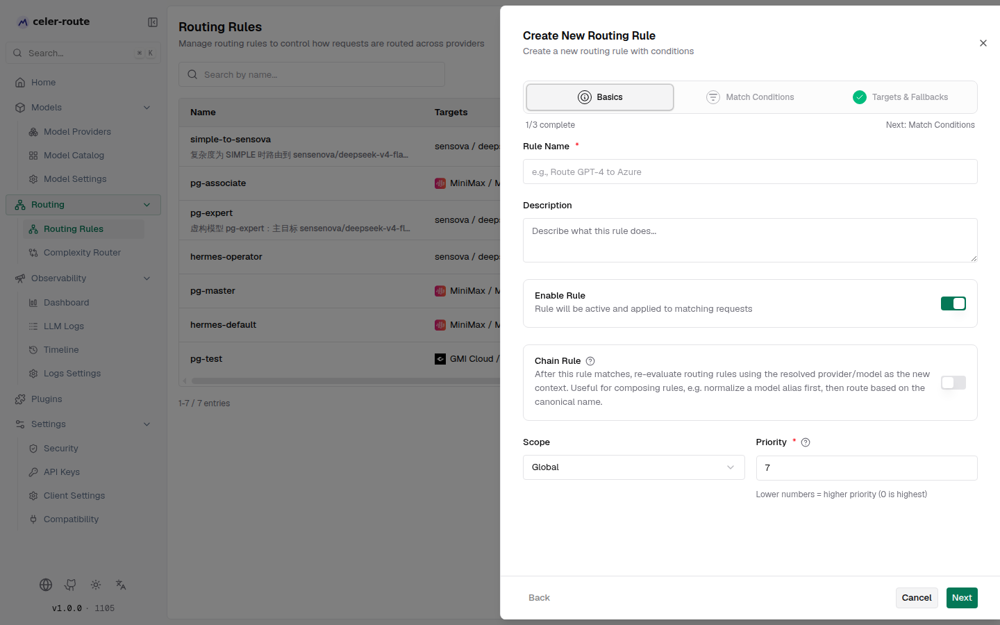
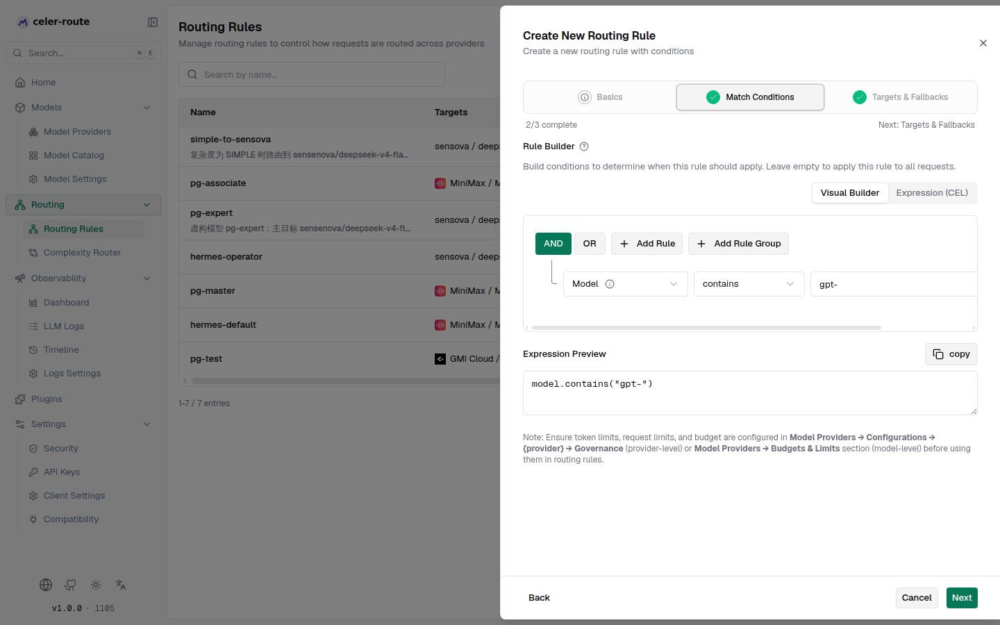
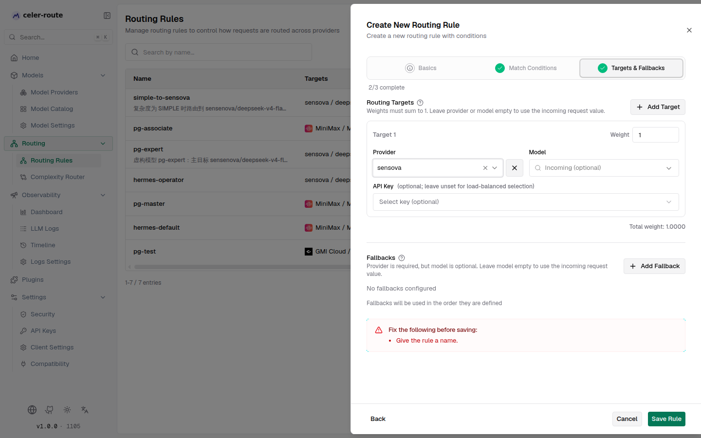
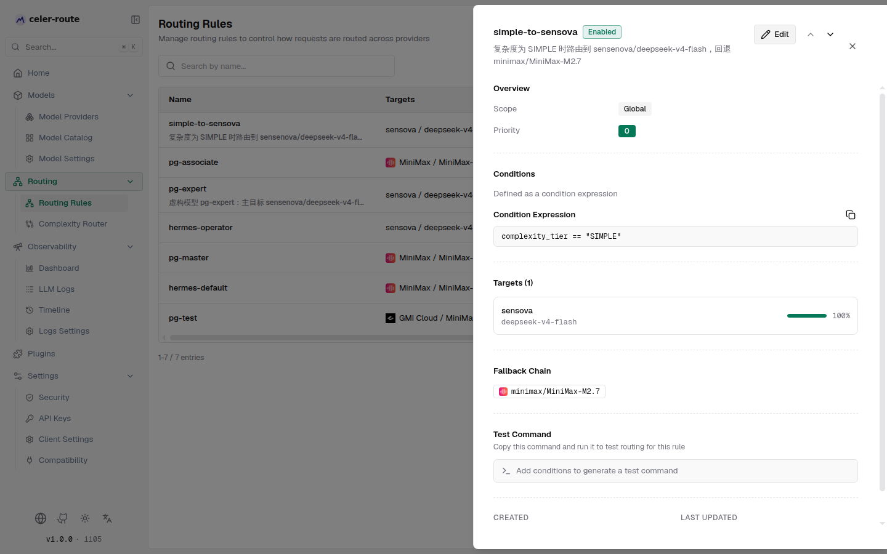
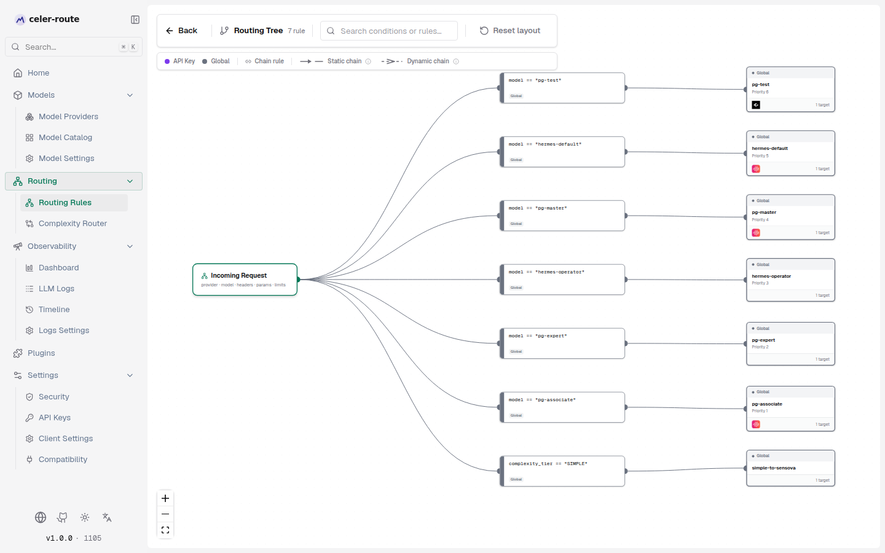
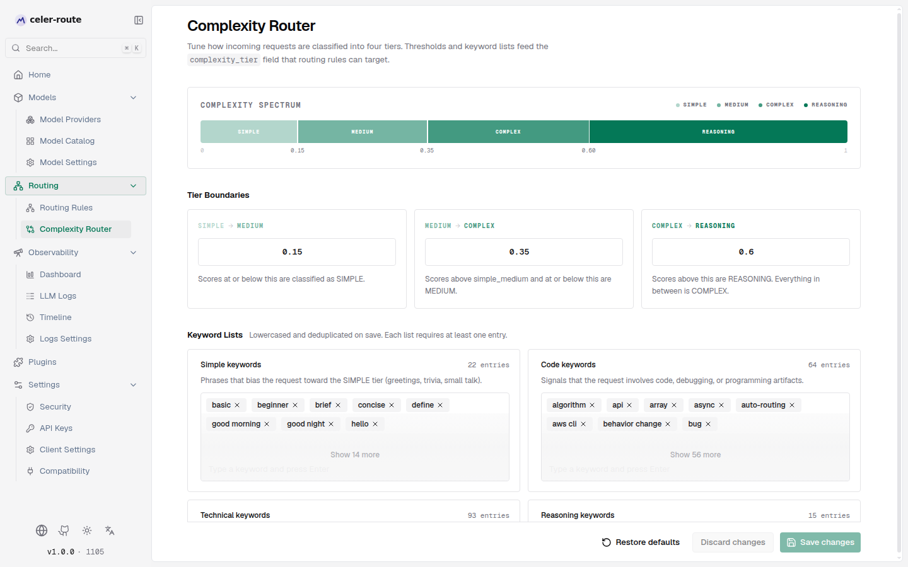

# Routing rules

**Routing rules** are celer-route's built-in intelligent request-dispatch
capability: when a request matches the conditions you set, celer-route routes
it to the provider, model, or even the specific key you specify, instead of
the default upstream. You can:

- **Route by condition** — match requests by model name, provider, request
  type, request headers, query parameters, budget usage, and more
- **Distribute by weight** — each rule can configure multiple targets and
  split traffic by weighted random
- **Chain rules** — normalize model aliases first, then route by the resolved
  model name
- **Fallback chains** — when the primary target fails, fall back to backup
  providers / models in order
- **Visual decision tree** — survey every rule's match path and targets at a
  glance with the tree view

All operations happen in the Web UI — no hand-written config files.

## How it works

| Aspect | Description |
|--------|-------------|
| **When it fires** | After every LLM request passes governance checks and before it is sent to the upstream provider, the routing engine evaluates rules in order of **scope precedence → priority value**. The first matching rule wins. |
| **Scope precedence** | Virtual Key > User > Team > Customer > Global. Rules in higher-precedence scopes are evaluated first; within the same scope, rules are sorted by priority value ascending (0 is highest). |
| **Match conditions** | Conditions are stored as CEL expressions. Both a visual builder (drag-and-drop) and a hand-written mode are supported. Leave the condition empty to match every request. |
| **Target selection** | Once matched, **one target** is selected from the rule's configured targets by weighted random. Weights must sum to 1. Leave provider / model blank to inherit the inbound request's value. |
| **Chain rules** | When **Chain rule** is enabled, the resolved provider / model feeds back as the new input and the entire scope chain is re-evaluated. It stops when no rule matches, a terminal rule matches, all candidate chain rules have already fired, or the maximum depth (default 10) is reached. Ideal for *normalize-aliases → route-by-real-model* compositions. |
| **Fallback chain** | When the chosen target's provider fails, fall back to backup providers / models in the order you defined. |
| **No rules** | When no routing rule matches, the request is forwarded as-is to the inbound provider and model — no rewriting. |

## Manage routing rules

Open **sidebar → Routing → Routing Rules**:

- The rule list auto-refreshes every 5 seconds, showing each rule's name,
  target summary, scope, priority, expression, and enabled state
- Use the search box at the top to filter by name; pagination shows 25 rules
  per page
- Drag any row to reorder (or use the up / down buttons); priority values
  rebalance automatically
- Each row has an **enable toggle** (takes effect immediately), **view**,
  **edit**, and **delete** buttons


## Create / edit a rule

Click **New rule** (or edit an existing one) to open the three-step wizard that
slides in from the right:

### Step 1 — Basics



| Field | Description |
|-------|-------------|
| **Rule name** | Required; identifies the rule in lists and logs. e.g. *Route GPT-4 to Azure* |
| **Description** | Optional; explains the rule's purpose |
| **Enable rule** | Toggle. When off, the rule is skipped during evaluation. The list-page toggle can switch this at any time |
| **Chain rule** | Toggle. When on, the resolved provider / model feeds back as the new input and the entire scope chain is re-evaluated. Ideal for compositions like *normalize-aliases → route-by-real-model* |
| **Scope** | **Global** (applies to all requests) or **Virtual Key** (applies only to a specific API key). Picking a virtual key requires selecting one |
| **Priority** | Required; integer 0–1000. Lower numbers mean higher priority (0 is highest). Within the same scope, rules are evaluated in ascending order |

### Step 2 — Match conditions



The condition builder supports two modes; you can switch between them at any time:

- **Visual builder** — drag-and-drop conditions without writing code. Leave
  empty to match every request
- **Hand-written expression** — write the CEL expression directly for advanced
  conditions

Available fields, grouped by category:

| Group | Field | Description |
|-------|-------|-------------|
| Request attributes | **Model** | Match the request's model name. Supports exact, list, contains, prefix / suffix, and regex patterns |
| | **Provider** | Match the upstream provider handling the request |
| | **Request type** | Filter by API request type (chat, text, embedding, image, audio, …). Streaming and non-streaming requests are different types |
| | **Complexity tier** | Route by the tier assigned by the complexity router — Simple, Medium, Complex, or Reasoning (see *Complexity routing* below) |
| Request content | **Has image** | The request body contains at least one image block (`image_url` in chat completions, `input_image` in the Responses API) |
| | **Has audio** | The request body contains at least one audio block (`input_audio`) |
| | **Has file** | The request body contains at least one file block (`file` / `input_file`) |
| | **Image count** | Number of image content blocks |
| | **Audio count** | Number of audio content blocks |
| | **File count** | Number of file content blocks |
| Metadata | **Request headers** | Match incoming HTTP headers; use lowercase header names |
| | **URL query parameters** | Match the request URL's query string parameters |
| Usage & budget | **Tokens used (%)** | Match the percentage of token usage against the model's and provider's configured limits |
| | **Request used (%)** | Match the percentage of request usage against the configured limits |
| | **Budget used (%)** | Match the percentage of budget usage against the configured budget |

:::note[Usage & budget conditions]
Before using `tokens_used`, `request`, or `budget_used`, configure token limits,
request limits, and budgets under **Model Providers → Configure → Governance**
(provider level) or **Model Providers → Budget & Limits** (model level);
otherwise these fields stay at 0.
:::

The bottom of the builder has an **expression preview** that shows the current
CEL expression in real time. Quick-start chips (e.g. *Model contains "gpt-"*,
*Provider is OpenAI*, *Chat completion*) insert pre-built conditions.

### Step 3 — Targets and fallbacks



**Routing targets** (at least one):

| Field | Description |
|-------|-------------|
| **Provider** | Target provider. Leave blank to inherit the inbound provider |
| **Model** | Target model. Leave blank to inherit the inbound model |
| **API key** | Optional. Pin a specific key (leave empty for load-balanced selection) |
| **Weight** | The share of requests this target receives. All targets' weights must sum to 1 |

A **Total weight** indicator sits at the bottom; if it isn't 1, click
**Normalize weights to 1** to fix it. Click **Add target** to add more.

**Fallbacks** (optional): when all targets fail, fall back to backup
providers / models in the defined order. Each fallback requires a provider;
the model is optional (leave blank to inherit the inbound model). Drag to
reorder the fallback chain.

## View rule details

In the list, click a rule's **view** button (or click the row) to open the
detail panel from the right:



The detail panel includes:

- **Overview** — scope, priority
- **Conditions** — the match conditions visualized, alongside the raw CEL
  expression (copyable)
- **Targets** — each target's provider, model, weight percentage, and pinned
  key (if any)
- **Fallback chain** — fallback providers / models in order
- **Test command** — auto-generated cURL / Python / Node.js / Go test
  commands matching the rule's conditions; copy and run them to verify the
  rule's routing. If authentication is enforced, pick a virtual key to embed
  the credentials in the generated command

## Tree view

Click **Tree view** at the top of the rule list to enter the read-only
decision-tree visualization:



The tree view shows the full routing decision as a left-to-right flow:

- The leftmost node is the **incoming request** (provider · model · headers ·
  params · limits)
- Middle nodes are **condition nodes**; rules that share the same prefix
  condition merge into parallel paths
- The rightmost nodes are **rule nodes**, showing the rule name, scope color
  marker, and target count
- Chain-rule loops are drawn as dashed edges, categorized as **static chain**
  (the re-entry point is fully proven by static analysis) and **dynamic chain**
  (conditional re-entry)

The top toolbar lets you search by condition or rule and reset the layout.
Nodes are draggable; positions are auto-saved to the browser. Click a node to
highlight the full upstream / downstream path.

## Complexity routing

**Complexity routing** is a companion capability to routing rules, found at
**sidebar → Routing → Complexity Router**:



The complexity router classifies each incoming request into one of four tiers
— **Simple, Medium, Complex, Reasoning** — and fills in the `complexity_tier`
field consumed by routing rules. That lets you split traffic by complexity —
for example, route Reasoning requests to a stronger model.

Classification is based on two parts:

- **Tier boundaries** — three thresholds (Simple → Medium, Medium →
  Complex, Complex → Reasoning) cut the complexity score into four bands
- **Keyword lists** — four groups (simple, code, technical, reasoning) whose
  matches raise or override the complexity score

The page lets you tune thresholds and keyword lists, with **Restore defaults**
and **Discard changes** available. Saved changes apply to subsequent requests.

## Multimodal content routing

Routing rules can split traffic by whether the **request body contains images,
audio, or files** (and by their counts). At evaluation time the gateway parses the
user-message content blocks of chat completions (`/v1/chat/completions`) and the
Responses API (`/v1/responses`) and exposes the following fields to match on:

| Field | Type | Meaning |
|-------|------|---------|
| `has_image` | boolean | The request body contains at least one image |
| `has_audio` | boolean | The request body contains at least one audio clip |
| `has_file` | boolean | The request body contains at least one file |
| `image_count` | integer | Number of image content blocks |
| `audio_count` | integer | Number of audio content blocks |
| `file_count` | integer | Number of file content blocks |

Image blocks are `image_url` in chat completions or `input_image` in the Responses
API; audio blocks are `input_audio`; file blocks are `file` / `input_file`. A
text-only request has all fields `false` / `0`, so conditions written against
"no multimodal content" (e.g. `has_image == false`) match text-only requests as
expected. The fields apply to both streaming and non-streaming requests.

In the visual builder these fields live in the **Request content** group — pick
`true` / `false` or enter a count; you can also write the CEL directly:

```cel
has_image == true                             // any image-bearing request
has_image == true && image_count >= 3         // at least three images
has_audio == true && !has_image               // audio only, no image
file_count > 0                                // any file
```

A typical cost-control play: route image/audio-bearing requests to a multimodal
vision/audio model, and leave text-only requests on a cheaper default model.

## Default behavior

- When no routing rules are defined, requests are forwarded as-is to the
  inbound provider and model — **works out of the box**
- When creating a new rule, the priority defaults to *current max + 1*, placing
  it after all existing rules
- Chain-rule maximum depth defaults to 10 to prevent infinite loops
- The routing engine's evaluation is logged against the request; you can
  inspect every matching step in **LLM logs** or **Timeline**

## Common scenarios

- **Normalize model aliases** — Create a chain rule that maps the alias
  `gpt-4` to the real provider / model; then create a second rule that routes
  by real model name to different targets. Chain rules hand off automatically
- **Split by model** — Set condition to *Model contains "gpt-"*, target Azure
  OpenAI's model; all other requests keep the default route
- **Weighted load balancing** — One rule with multiple targets (e.g. 70%
  OpenAI, 30% Azure); weights must sum to 1
- **Switch on budget** — Set condition to *Budget used (%) > 80*, target a
  cheaper provider to avoid overspend
- **Route by header** — Set condition to
  `headers["x-route-to"] == "canary"`, canary traffic flows to the named
  provider
- **Route by complexity** — Tune thresholds and keywords on the complexity
  router page first; then in routing rules, use
  `complexity_tier == "reasoning"` to send Reasoning requests to the reasoning
  model
- **Route by multimodal content** — Set *Has image* to `true` and target a
  vision-capable model (e.g. `gpt-4o`); text-only requests stay on the default
  cheaper model, controlling cost by content
