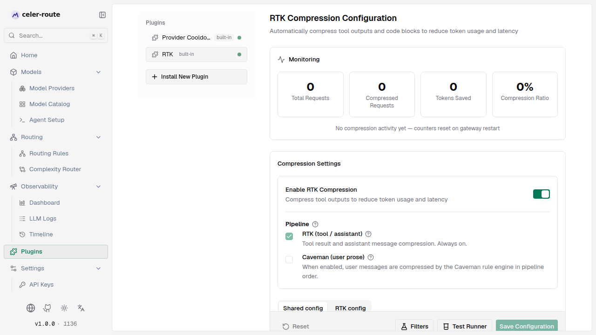
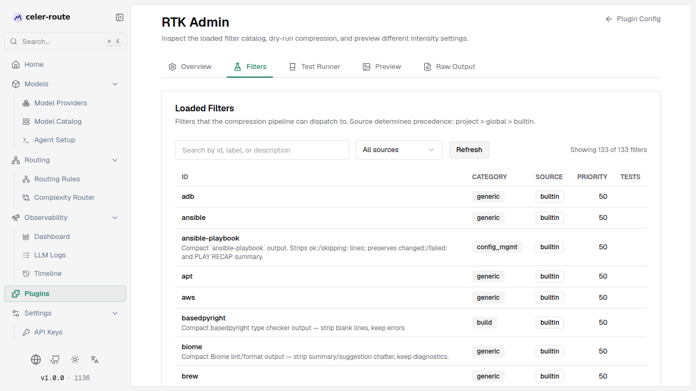
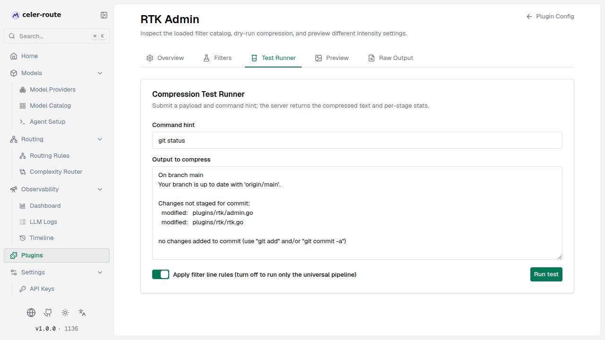

# RTK compression

**RTK (Rule-based Tool-output Kompression)** is a context-compression plugin
built into celer-route. Before every LLM request, it automatically compresses
tool outputs (`tool_result`) and code blocks, shrinking verbose execution
results to cut token usage and reduce latency; after the response comes back,
it also corrects the response's token usage to the post-compression real
value, so billing and stats stay accurate.

No client-side changes are needed — compression is transparent to the model,
and **fails open**: any compression error falls back to the original text,
never breaking the request.

## How it works

| Aspect | Description |
|--------|-------------|
| **Pre-request compression** | Before the request is sent to the model, scan messages for tool outputs and code blocks and apply the compression pipeline (deduplication, smart truncation, near-line grouping, line filtering, semantic rendering) to reduce size |
| **Post-request correction** | After the model responds, rewrite the response's prompt token count to the post-compression value, and write both raw and compressed counts so billing and logs read the right number |
| **Fails open** | Any compression step that errors falls back to the original text and the request still goes out; compression never breaks a request |
| **Pipeline engines** | Engines run in a fixed order **RTK → Caveman**. RTK targets tool results and assistant messages and is always on while the plugin is enabled; Caveman targets user messages and is opt-in |
| **Original output recoverable** | Compressed tool outputs end with an auth-free recovery link (`GET /api/context/rtk/raw-output/<id>`); the LLM can fetch the original itself when needed |

## Enable / disable

Open **left sidebar → Plugins** and select **RTK**:

1. Find the **Enable RTK Compression** toggle and turn it on (it is on by
   default)
2. Turning it off disables the compression pipeline for all requests — handy
   for A/B testing cost and quality before vs. after compression
3. Below the enablement switch is the **Pipeline** group: **RTK (tool / assistant)** is always checked and cannot be turned off; **Caveman (user prose)** is unchecked by default — enable it when you also want user-message prose compressed



## Start fast with a preset

At the top of the config page, **Quick presets** cover 80% of cases with a
single click:

| Preset | Trade-off | When to use |
|--------|-----------|-------------|
| **Minimal** | Keep more context, save fewer tokens | When you're worried about losing key information |
| **Standard** (recommended starting point) | Balanced for general scenarios | Default value |
| **Aggressive** | Maximum compression, sacrifices some context for the lowest tokens | Long tool outputs where the model only needs the highlights |

Clicking a preset auto-fills a sensible set of parameters (line/char limits,
dedup threshold, whether to group, minimum compressed token count, etc.).
You can still fine-tune each value below, then click **Save Configuration**.
If you mess it up, click **Revert preset** to roll the preset-managed fields
back to the last saved value.

Presets only manage the 7 most common fields. **Smart Grouping**, **Debug: Raw Output**, **Advanced: Pipeline & Threshold**, and **Caveman** are independent advanced settings — presets do not touch them.

## Monitor compression effect

The plugin page **Monitoring** panel refreshes every 5 seconds with four
aggregate metrics and a per-engine breakdown:

| Metric | Meaning |
|--------|---------|
| **Total Requests** | Number of LLM requests passing through the gateway |
| **Compressed Requests** | Number of requests that actually triggered compression |
| **Tokens Saved** | Cumulative difference between pre- and post-compression prompt tokens |
| **Compression Ratio** | Savings as a fraction of the original volume |

**Per-engine breakdown** (only shown once RTK / Caveman has actually run) —
one row per engine: invocations, input / output bytes, compression ratio.

:::note
The counters live **in process memory** — **restarting the gateway resets
them to zero**. A freshly-started gateway will show "No compression activity
yet — counters reset on gateway restart" — that is normal.
:::

## Fine-tune the configuration

### Preset-managed fields (7)

| Field | Meaning | When to adjust |
|-------|---------|----------------|
| **Compression Intensity** | Controls aggressiveness, scaling the line/char limits proportionally (Minimal ×1.5, Standard ×1.0, Aggressive ×0.5) | Long tool outputs where the model only needs highlights → raise; afraid of losing context → lower |
| **Max Lines Per Result** | Max lines retained per tool result after compression (the page shows "Effective value: N lines" with the scaled preview) | Model frequently misses mid-block key info → raise; don't need that much detail → lower |
| **Max Chars Per Result** | Same idea, by character count — a safety net against a single result filling the context window | Same as above |
| **Dedup Threshold** | Triggers deduplication when consecutive identical lines reach this count | Lots of repeated lines (consecutive failures, looped prints) → lower to 2 or 3 |
| **Enable Grouping / Grouping Threshold** | Merges "nearly identical" consecutive lines that differ only in timestamp/number/version | Time-series logs, build artifact lists → enable; default threshold of 3 is usually enough |
| **Min Tokens To Compress** | Skip compression when estimated request tokens are below this threshold (0 = always compress) | Small requests → raise to save processing time; agent workflows with high-token requests → set to 0 |

### Independent advanced settings

| Section | Key fields | Description |
|---------|-----------|-------------|
| **Smart Grouping** | Enable Grouping / Grouping Threshold | Defaults come from the preset; expand to fine-tune the threshold independently |
| **Semantic Compression** | Enable Semantic Compression + Skip detection types | After line filtering, rewrites structured outputs (git diff, test suites, terraform plan, JSON tables) into a more compact form. Fail-open — safe to enable |
| **Debug: Raw Output** | Raw Output Retention (Never / On Failures / Always) + Max Bytes + Directory + TTL | Also feeds the **LLM Logs → RTK Compression** tab's pre-compression text; switch to "On Failures" or "Always" to enable per-message diffing |
| **Advanced: Pipeline & Threshold** | Min Tokens To Compress | Same as above |
| **Caveman (Prose Compression)** | Caveman Intensity + Min Message Length + Skip Rules + Preserve Patterns | Only takes effect once Caveman is checked in the Pipeline group. Targets user-role prose via rule-based transformations (redundant phrasing, pleasantries, soft quantifiers, articles, etc.); intensities Lite / Full / Ultra |

### Shared config vs engine config

The page has two tabs at the top:

- **Shared config**: Raw-output fields (retention, max bytes, TTL, directory) that apply to both RTK and Caveman
- **RTK config**: RTK engine's own preset / line / char / dedup / grouping / semantic-compression fields
- (only when Caveman is enabled) **Caveman config**: Caveman engine's intensity / min length / skip rules / preserve patterns

## Validate & debug

At the bottom of the config page, the **Reset / Filters / Test Runner / Save Configuration** button row plus the **"Want to see the effect?"** block provide several verification entry points — no need to change runtime config to compare pre- and post-compression:

- **Test Runner** (`/workspace/plugins/rtk/test`) — run the compression pipeline
  over any output and compare the original and compressed text side by side,
  showing the matched filter and per-stage token counts
- **Preview** (`/workspace/plugins/rtk/preview`) — preview how `rtk` / `stacked` / `off` modes affect output without changing runtime config
- **Filters** (`/workspace/plugins/rtk/filters`) — browse the loaded
  built-in + project + global filter list and load diagnostics
- **Raw Output** (`/workspace/plugins/rtk/raw-output`) — open a persisted raw output by its 24-char hex id



The priority is **project > global > built-in**. The built-in filters cover
common tool outputs (compilers, type checkers, test suites, helm, shellcheck,
etc.) and take effect with zero configuration.



## Raw output recovery

When a tool output is compressed, RTK embeds a recovery marker at the end,
of the form:

```
[rtk:raw_output_id=<24-char hex ID>; orig=<original size>; ttl=24h; redacted=true; fetch=GET /api/context/rtk/raw-output/<id>]
```

- The **24-char hex ID is the access credential** (96 bits of entropy); its
  holder can `GET` the truncated original without an Authorization header
- RTK also injects a **byte-stable** recovery hint into the request's system
  message, telling the model how to fetch the original (the hint is content-
  stable across requests and does not break Anthropic / OpenAI prompt-cache
  prefixes)
- The original is kept on disk until the **TTL expires** (default 24 hours,
  max 168 hours / 1 week), after which a janitor cleans it up

**Retention policy** ("Debug: Raw Output → Raw Output Retention") decides
when to persist the original:

| Mode | Behavior | Recommended |
|------|----------|-------------|
| **Never** | Don't persist; minimal disk usage | Day-to-day stable runtime |
| **On Failures** | Only persist when compression fails (falls back to original) | While troubleshooting |
| **Always** (default) | Persist on every compression, with recovery link | Debugging / want the LLM to self-fetch the original |

**Raw Output Max Bytes** (default 1 MB) caps the persisted size per entry. **Raw Output TTL (hours)** (default 24) controls the cleanup cycle — set to 0 to disable the janitor and keep files forever. **Raw Output Directory** is blank by default and resolves to the server's `<appDir>/rtk/raw-output`; when set, it must be an absolute path.

:::note
The default is "Always", so every truncation is recoverable. When disk space
is tight, switch to "Never" or "On Failures", and lower the **Raw Output Max Bytes**. Remember to switch back when you're done debugging.
:::

## Default behavior

RTK works out of the box — no configuration needed:

- The plugin is **enabled by default** (an all-zero config is auto-enabled
  when nothing is explicitly set in storage)
- Default strength **Standard**, retains 120 lines / 12000 chars per result,
  dedup threshold 3
- **Pipeline** defaults to RTK always on, Caveman off
- Dozens of built-in filters are active automatically, with zero configuration
- Raw output defaults to **Always**, TTL 24 hours, per-entry cap 1 MB. The
  **LLM Logs → RTK Compression** tab also pulls pre-compression text from
  here — switch to "On Failures" or "Always" to enable per-message diffing

## Common scenarios

- **Token usage spikes in agent workflows** → confirm "Enable RTK
  Compression" is on, set intensity to "Aggressive", turn on "Enable
  Grouping" to merge similar log lines
- **The model misses key info after compression** → drop intensity back to
  "Standard" or "Minimal"; raise "Max Lines Per Result"
- **Investigating what a particular compression dropped** → set "Raw Output
  Retention" to "On Failures" or "Always", then go to the RTK Compression
  tab in the LLM log detail to see pre- and post-compression (the tab
  fetches the original via the 24-hex id); or reproduce with the same
  input in "Test Runner"
- **The LLM needs some truncated original** → as long as retention policy is
  not "Never", let the model `GET` the recovery link appended to the result
- **User messages are full of pleasantries / soft quantifiers** → check
  **Caveman (user prose)** in the Pipeline group, set intensity to
  "Full (balanced)" to also rule-compress user-role prose
- **Want to see which stages of the pipeline ran** → open LLM Logs →
  RTK Compression tab on the request — it lists the matched filter,
  which messages participated in compression, and per-stage stats
