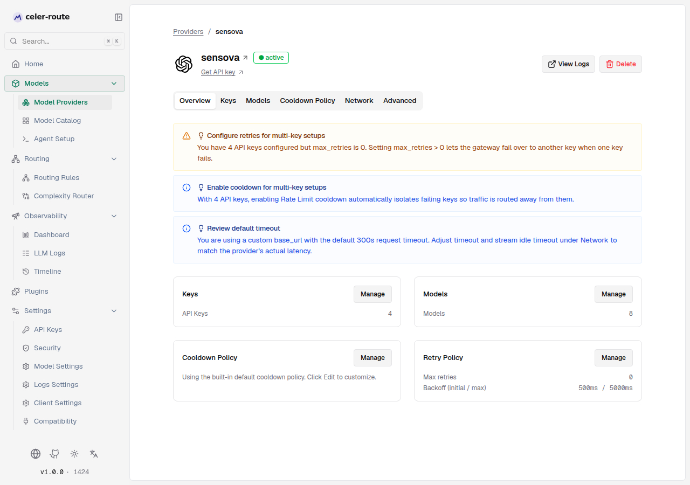
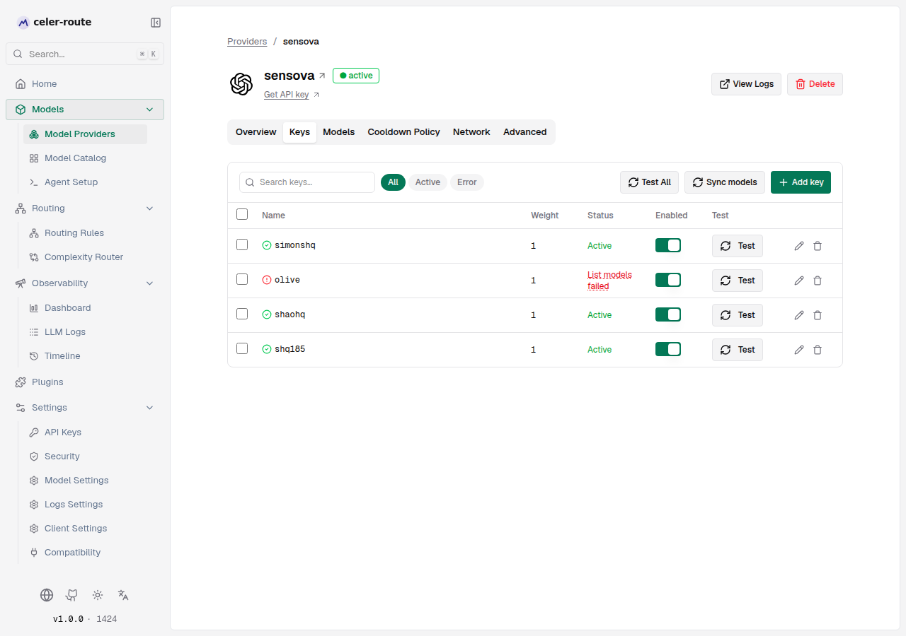
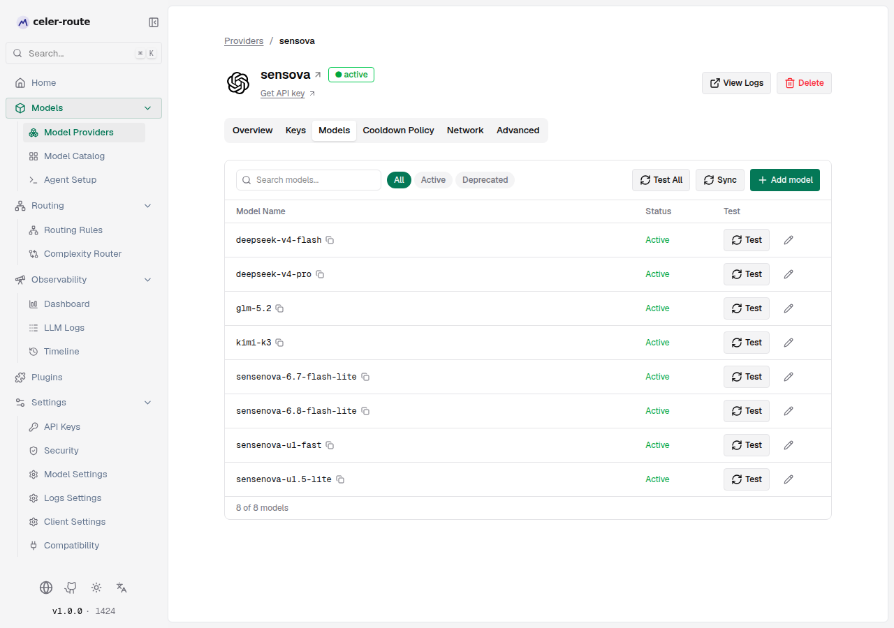
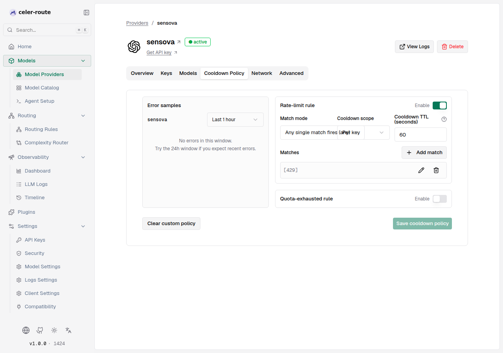
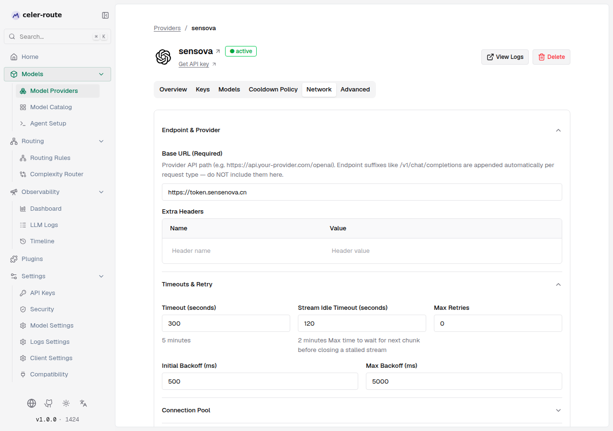
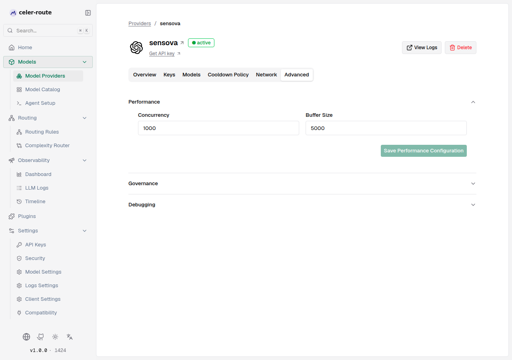

# Provider detail page

Clicking any provider card on the **Model Providers** list opens
`/workspace/providers/$id`, a tabbed detail page that consolidates every
per-provider concern—configuration, monitoring, diagnostics—into a single
screen. Above the tab bar sits a header (name, status, external links,
actions); below it sit six tabs: **Overview, Keys, Models, Cooldown Policy,
Network, Advanced**. This page walks through what each area does, what you
see, and when you actually need to click in.

## Page header

Every detail page renders the same fixed header (see
`ui/app/workspace/providers/$id/page.tsx`):

- **Breadcrumb**: `Providers / {provider name}`. Clicking `Providers`
  returns to the list.
- **Icon + name + status badge**: A green `● active` badge appears next
  to the name when at least one key is configured and `provider_status`
  is `active`.
- **Get API key**: Only shown for providers that need a key and have an
  official key-application URL (from the `ProviderApiKeyUrls` constant).
- **View Logs**: Jumps to **LLM Logs** with this provider pre-selected as
  a filter.
- **Delete**: Removes the provider and its associated config (requires
  `ModelProvider:Delete` RBAC).

The header's status badge lets you read key health at a glance—you don't
have to open the **Keys** tab just to know if the provider is healthy.

## Overview

The Overview tab combines a **smart-suggestions** strip with **four
read-only cards**. The goal is to let you spot configuration issues that
need fixing *without leaving the Overview page*, then jump straight to the
right tab.

### Configuration suggestions (automatic hints)

A row of lightweight alerts appears at the top based on the current
configuration. The trigger logic lives in
`ui/app/workspace/providers/$id/views/ConfigSuggestions.tsx`, and every
condition maps to real fields:

| Trigger condition | Title | Hint meaning |
|---|---|---|
| More than 1 API key configured but `max_retries = 0` | Configure retries for multi-key setups | The gateway won't fail over to another key when one fails. |
| More than 1 API key configured but Rate Limit cooldown is disabled | Enable cooldown for multi-key setups | Failing keys won't be isolated automatically. |
| `models_count = 0` | No models configured | The provider has no routable model—go to the **Models** tab to add or sync. |
| Anthropic family (`anthropic` / `vertex` / `bedrock` / `bedrock_mantle` / `azure`) with no Beta header overrides | Customize Beta headers | Defaults are on; override per beta feature under **Advanced → Beta headers** if needed. |
| Custom `base_url` set but request timeout is the default 300s | Review default timeout | Self-hosted / proxied setups may have very different latencies. |

Suggestions are read-only hints—they never auto-apply changes. Clicking
**Manage** on the relevant card jumps you straight to the right tab.

### Four read-only cards

| Card | Shows | Jumps to |
|---|---|---|
| Keys | Number of API keys currently configured | **Keys** tab |
| Models | Number of routable models | **Models** tab |
| Cooldown Policy | "Using the built-in default cooldown policy…" or, after override, the `rate_limit` / `quota` TTLs | **Cooldown Policy** tab |
| Retry Policy | `max_retries` and backoff (initial / max) | **Network** tab |

The point of the read-only cards is to give you a *single screenshot* that
explains the current configuration to teammates or auditors, without
having to open six tabs.

## Keys

The Keys tab is the operational heart of provider management: add/remove
API keys, adjust weights, enable/disable, batch-test, and sync models.

The toolbar offers:

- **Search keys**: filter by key name.
- **Health filter**: `All / Active / Error` (a key is *healthy* when
  `enabled !== false` and `status === "success"` or unset).
- **Test All**: Calls `POST /refresh-models` for each key, reporting
  pass/fail counts at the end.
- **Sync models**: Triggers a model refresh for all keys under this
  provider.
- **Add key**: Opens a side sheet for new key configuration
  (authentication method, weight, allowed/blocked models, deployment
  overrides, etc.).

Each row supports:

- **Multi-select + batch enable/disable/retest/delete**: Select rows and
  the bulk-action bar appears at the top.
- **Enabled switch**: Toggle a single key on/off.
- **Test**: Calls `refresh-models` for that key only; toast shows either
  "key test passed" or "key test failed".
- **Edit / Delete**: Pencil / trash icons at the row end; delete shows a
  confirmation dialog.

For **keyless providers** (`is_key_less = true`, e.g. `ollama`, `vllm`,
`sgl`, `opencode`), the tab shows the static notice
`This provider does not require an API key — key management is not
applicable.` and does not render the table.

### Status badge meaning

| Status | Color | Meaning |
|---|---|---|
| Active | Green | Key is enabled and the last `list_models` succeeded. |
| List models failed | Red, dotted underline | The key's `list_models` returned an error (hover for the message). |
| Error | Red | Other failures (e.g. 401/403). |

## Models

The Models tab manages *which model IDs are routable under this provider*.

Toolbar:

- **Search models**: Server-side substring search (300ms debounce).
- **Status filter**: `All / Active / Deprecated`.
- **Test All**: Calls `test-models` for every non-deprecated model in the
  current filter; a top progress bar shows `done / total`.
- **Sync**: Triggers a model refresh for this provider (same effect as
  the **Sync models** button on the **Keys** tab).
- **Add model**: Opens the **Add custom model** sheet, used to register a
  model ID that key discovery didn't surface automatically (e.g. a custom
  deployment name), with its `mode` (chat completion / text completion /
  embedding / image / audio).

Each row supports:

- **Copy**: The copy button next to the model name copies
  `provider/model` — the qualified ID for clients' `model` field.
- **Test**: Single-model test; status renders in place as `XXms` on
  success or `Failed` on error (hover for the message).
- **Edit attributes**: Opens the **Attribute sheet**, where you can
  adjust pricing, rate limits, context window, and other catalog
  attributes.

The footer reads `X of X models`, with ` matching "query"` appended when a
search is active.

## Cooldown Policy

The Cooldown Policy tab holds the **per-provider** rate-limit /
quota-isolation rules. Each key enters cooldown independently; while in
cooldown it will not be picked by the router.

The page has two halves: **Error samples** on the left and **Rule
configuration** on the right.

### Error samples (reference)

The **Error samples** card pulls recent errors for this provider from the
log store (window: **Last 1 hour** or **Last 24 hours**). Clicking
**Apply** converts a sample into a new match entry — saves you typing the
HTTP status code, error type, or error code by hand.

If the window has no errors, the card shows
`No errors in this window. Try the 24h window if you expect recent errors.`

### Rule configuration (rate-limit / quota-exhausted)

Two rule types can be enabled simultaneously:

| Rule | Meaning | Key parameters |
|---|---|---|
| Rate-limit rule (`rate_limit`) | Triggered when the upstream rejects a request (typically 429). | Enable, Match mode (`any` / `all`), Cooldown scope (Per key / Per key per model), Cooldown TTL (seconds), Matches |
| Quota-exhausted rule (`quota`) | Triggered when the account-level quota is gone (typically billing-related). | Same as above. |

Each match entry combines up to four conditions: HTTP status code, error
message substring, error type, error code. Match mode decides whether
*any* match or *all* matches must hit to enter cooldown.

If both switches are off, a **Clear custom policy** button appears at the
bottom; clicking it restores the **built-in default cooldown policy**
(OpenAI defaults: rate limit 60s, quota 600s; defined in
`core/schemas/provider.go` as `DefaultCooldownPolicy`).

> New to cooldown? Read the dedicated *Provider cooldown* page (in the
> **Features** category) — this tab is only its UI entry point.

## Network

The Network tab centralises **endpoint, timeouts, retries, connection
pool, and proxy / TLS** parameters. The form has four collapsible groups
(**Endpoint & Provider** and **Timeouts & Retry** expanded by default):

### Endpoint & Provider

- **Base URL** — *Required* for custom providers, *Optional* for built-ins.
  Fill in only the path prefix (e.g. `https://api.your-provider.com/openai`);
  the gateway appends `/v1/chat/completions` etc. automatically per request
  type.
- **Extra headers** — key/value pairs appended to every upstream request
  to this provider; common use cases are internal proxy headers or a
  canary tag.

### Timeouts & Retry

- **Timeout (seconds)**: overall request timeout; rendered in human
  form below (e.g. `5 minutes`).
- **Stream idle timeout (seconds)**: how long to wait for the next chunk
  before closing a stalled stream. Streaming responses are *not* bounded
  by the overall timeout.
- **Max retries**: cap on automatic retries.
- **Initial backoff (ms)** / **Max backoff (ms)**: bounds for the
  exponential backoff between retries.

### Connection pool

- **Max connections per host**: the fasthttp client connection-pool
  ceiling per upstream host. HTTP/2 providers (e.g. Bedrock) get ~100
  concurrent streams per connection; raise this if you need more.
- **Keep-alive timeout (seconds)**: idle keep-alive for pooled
  connections. Set this slightly below the upstream's keep-alive to
  avoid reusing a half-closed connection.
- **Enforce HTTP/2**: meaningful only for `net/http`-based providers
  (e.g. Bedrock).

### Proxy & Security

- **Proxy type**: `None / HTTP / SOCKS5 / Environment`. Once a non-empty
  type is chosen, the URL, username, password, and CA certificate (PEM)
  fields appear.
- Proxy URL also supports `env.MY_VAR` interpolation.
- **TLS / Certificate**: *Skip TLS verification* (last resort) and
  *CA certificate (PEM)* (supports `env.X` interpolation).

After editing, the **Save network configuration** button at the bottom
becomes enabled. Clearing the `base_url` is validated against the current
state to avoid silently removing the entire network config.

## Advanced

The Advanced tab is **a stack of on-demand accordion panels** whose
contents vary by provider type (control logic in
`ui/app/workspace/providers/$id/views/AdvancedTab.tsx`):

| Accordion | Default visibility | Description |
|---|---|---|
| Performance | Always shown | Per-provider concurrency and buffer size (affects that provider's internal worker pool). |
| Governance | Always shown (requires `Governance:View` RBAC) | Provider-level budget cap and rate limit (linked to the global Governance page). |
| Beta headers | Anthropic family only (`anthropic` / `vertex` / `bedrock` / `bedrock_mantle` / `azure`) | Per-Anthropic-Beta-header override with built-in toggles + custom prefix. |
| OpenAI config | `openai` provider only | Toggle the Responses API `store` default (turning off `store` keeps response IDs from becoming persistent server-side objects). |
| Debugging | Always shown | Toggles for *Send back raw request / Send back raw response / Store raw request-response* with per-request header overrides. |

### Beta headers (Anthropic family only)

Each Beta capability has three states:

- **Supported**: send the corresponding Beta header.
- **Unsupported**: explicitly omit it.
- **Default**: follow Anthropic's built-in defaults.

Custom Beta header prefixes (e.g. `new-feature-`) can be added on top.
Prefixes may only contain lowercase letters, digits, and hyphens, and may
not collide with built-in entries.

### Debugging (all providers)

Each Debugging toggle affects both *this provider* and *per-request
header overrides*, acting at different points in the request lifecycle:

| Toggle | Per-request header | Meaning |
|---|---|---|
| Send back raw request | `x-bf-send-back-raw-request: true/false` | Include the raw upstream request body in the API response. |
| Send back raw response | `x-bf-send-back-raw-response: true/false` | Include the raw upstream response body in the API response. |
| Store raw request-response | `x-bf-store-raw-request-response: true/false` | Persist raw request and response payloads in the log store. |

All three are independent. The intended workflow is *off by default in
production, temporarily flipped per request when investigating an issue*.

## Default behavior

| Scenario | Default |
|---|---|
| No API key yet | Status badge hidden; Keys tab shows empty state ("No keys found."); Models tab shows "No models found for this provider". |
| Multiple keys but `max_retries = 0` | Overview shows "Configure retries for multi-key setups" warning; not auto-fixed. |
| No custom cooldown policy | Cooldown Policy tab shows "Using the built-in default cooldown policy…"; OpenAI defaults are 60s rate-limit / 600s quota. |
| Custom provider without a base URL | Network tab's save button is disabled with the message "Custom providers must specify a base URL". |
| `is_key_less = true` provider (Ollama / vLLM / SGLang / OpenCode) | Keys tab renders "This provider does not require an API key — key management is not applicable." |

## Common task lookup

| If you want to… | Where to click |
|---|---|
| Add a new API key | Keys tab → Add key |
| Health-check multiple keys at once | Keys tab → Test All |
| Remove a deprecated model from routing | Models tab → status filter "Deprecated" → Edit attributes |
| Stop upstream 429s from blocking traffic on a single key | Cooldown Policy tab → enable Rate-limit rule → add a `status code = 429` match |
| Your self-hosted backend has higher latency than the public API | Network tab → Timeouts & Retry → bump Timeout and Stream idle timeout |
| Your reverse proxy needs fixed headers | Network tab → Endpoint & Provider → Extra headers |
| Route through a canary / staging proxy | Network tab → Proxy & Security → set Proxy type to `HTTP` and fill the URL |
| Temporarily debug a single request | Advanced tab → Debugging → enable Send back raw request / response |
| A user reports one key failing while others are healthy | Keys tab → health filter "Error" → test or disable that key |
| Jump to the request logs filtered to this provider | Header → "View Logs" button |

## Related

- [Supported providers](./supported-providers) — full list of 40+ built-in providers
- *Provider cooldown* (in the **Features** category) — background and best practices for cooldown rules
